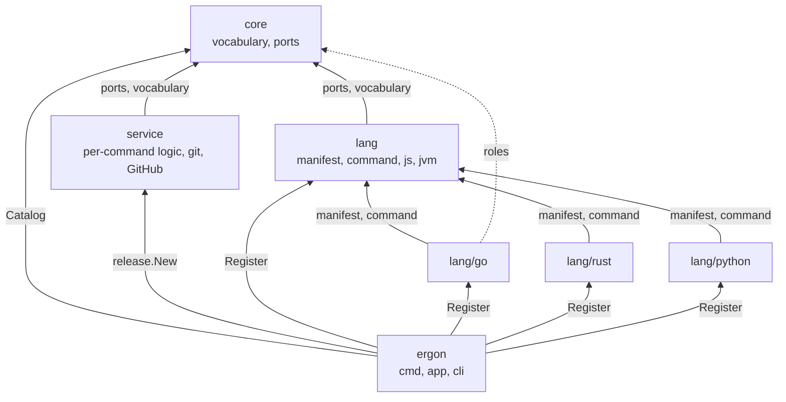

# RFC-0001: Module boundaries

## Summary

Split ergon into Go modules in one repository.
`core` contains the vocabulary and the ports.
`service` contains the language-neutral side of each command, and the clients for git and GitHub.
`lang` contains the machinery that two or more languages use, including the JavaScript and JVM toolchains.
One module per remaining language contains that language's side of every command.
The root module contains the binary and the composition root.
Dependencies run one way, so adding a language is a directory, a `go.work` line and one `Register` call.

## Motivation

Every ergon command has a part that differs per language and a part that does not.
`release` rewrites `go.mod`, `Cargo.toml`, `package.json`, `pyproject.toml` and `gradle.properties` in five different ways, and it plans the release the same way for all of them.
The commands after `release` follow the same split.
A test runner, a coverage parser and a lint task list differ per language, while thresholds, stage filters and reports do not.
The earlier Go-only ergon had 15,040 lines of production code in 32 packages, and around 3,000 of those lines encoded Go semantics.

The per-language part brings its own dependencies and its own toolchain:

| Language | Third-party Go dependency for `release` | Toolchain its tests run |
|---|---|---|
| Go | `golang.org/x/mod` v0.40.0 | `go`, `git` |
| Rust | a TOML parser with byte ranges | `cargo` |
| Python | a TOML parser with byte ranges | `uv` |
| TypeScript, JavaScript | none; `encoding/json` reports offsets | `node`, `npm`, `pnpm`, `bun` |
| Java, Kotlin | none; `encoding/xml` reports offsets | a JDK, Gradle |

Go declares dependencies per module.
A module per language keeps `golang.org/x/mod` out of the Rust module's `go.sum`.
It also lets `go test ./...` in one language's directory run with only that language's toolchain installed, so the CI matrix gets one row per module with one toolchain each.

A module that contains both a contract and the code consuming it lets the two grow into each other.
A consumer comes to take a concrete service instead of an interface, and a second copy of a rule appears in a second consumer.
The boundary between `core` and its consumers makes that visible to a linter.

## Detailed design

### The module graph

| Directory | Module path | Contains | Third-party |
|---|---|---|---|
| `ergon-core/` | `go.dokimi.dev/ergon/core` | Vocabulary, the language declaration, the catalog, and the role interfaces | none |
| `ergon-service/` | `go.dokimi.dev/ergon/service` | The language-neutral side of each command, git, and the GitHub client | none |
| `ergon-lang/` | `go.dokimi.dev/ergon/lang` | Manifest editing, the subprocess runner, the conformance suite, and the JavaScript and JVM toolchains | a TOML parser |
| `ergon-lang-go/` | `go.dokimi.dev/ergon/lang/go` | Go | `golang.org/x/mod` |
| `ergon-lang-rust/` | `go.dokimi.dev/ergon/lang/rust` | Rust with Cargo | none beyond `lang` |
| `ergon-lang-python/` | `go.dokimi.dev/ergon/lang/python` | Python with `pyproject.toml` and uv | none beyond `lang` |
| `.` | `go.dokimi.dev/ergon` | `cmd/ergon`, the composition root, the command tree | a CLI library |



### The rules

1. `core` imports nothing else in this repository.
2. `service` imports `core` and nothing else in this repository.
3. `lang` imports `core` and nothing else in this repository.
4. `lang/<x>` imports `core` and `lang`, and never another `lang/<x>`.
5. Only the root module imports a `lang/<x>`, `lang/js` or `lang/jvm`.
6. Only `service/vcs` and `lang/go/release` run git. `lang/go/release` runs it through `golang.org/x/mod/zip.CreateFromVCS`, which runs `git archive`.
7. Only `service/forge` calls the GitHub API, and no other package in `service` imports it.

A service is given what it calls through an interface the service declares. `service/release` declares the `Forge` interface, and `service/forge` satisfies it without importing `release`. The root module joins the two.

depguard enforces the rules from the root `.golangci.yml`, with a strict allow-list per module directory:

```yaml
linters:
  settings:
    depguard:
      rules:
        core:
          files: ["**/ergon-core/**"]
          list-mode: strict
          allow:
            - $gostd
            - go.dokimi.dev/ergon/core
        lang:
          files: ["**/ergon-lang/**"]
          list-mode: strict
          allow:
            - $gostd
            - go.dokimi.dev/ergon/core
            - go.dokimi.dev/ergon/lang$
            - go.dokimi.dev/ergon/lang/manifest
            - go.dokimi.dev/ergon/lang/command
```

The `$` suffix asks depguard for an exact match. Without it, allowing `go.dokimi.dev/ergon/lang` would also allow `go.dokimi.dev/ergon/lang/go`.

The `go.mod` files cannot enforce these rules. Inside the workspace, `go.work` puts every module in the build list, so a module imports a sibling and builds without a `require` line for it. Only `GOWORK=off` reports the missing line.

### Roles

Each command's ports are role interfaces in `core/language`, one file per command. A language implements the roles it supports. A command asks the catalog for the languages that implement its role, selecting by type assertion, and reports `Unsupported` for a language without it.

```go
// Declaration states the facts about a language that every command reads.
// A language module constructs exactly one.
type Declaration struct {
	// Name identifies the language in configuration and in reports.
	Name workspace.Language

	// Markers are the file names whose presence activates the language,
	// such as "go.mod" or "Cargo.toml".
	Markers []string

	// Discover lists the packages under root. It reads files, and it runs
	// a subprocess only when a manifest is a program, as a Gradle settings
	// script is.
	Discover func(ctx context.Context, root string) ([]workspace.Package, error)
}

// Register adds a language and the role implementations it provides to the
// catalog. It returns an error when the declaration is incomplete or the
// name is already registered.
func Register(c *Catalog, d Declaration, roles ...any) error
```

Each role is checked at compile time in the package that implements it:

```go
var (
	_ language.Versioner = (*Release)(nil)
	_ language.Packer    = (*Release)(nil)
)
```

Without that assertion, a signature that drifts from its role removes a capability without breaking the build.

### Registration

The root module's `internal/app` calls `Register` once per language. Nothing registers from `init`. An `init` with a blank import makes the language set depend on which packages happen to be imported. A test could then not build a catalog that contains only Go.

### Where JavaScript and JVM go

TypeScript and JavaScript share the npm registry and one of three package managers. Java and Kotlin share Gradle, or Maven, and Maven Central. Each toolchain is machinery that two languages use, so it is a package in `lang`: `lang/js` and `lang/jvm`. A module of its own would contain no dependency, because JSON and XML offsets come from the standard library.

TypeScript, JavaScript, Java and Kotlin each get a language module of their own when a command needs code specific to that language, such as a Kotlin-only lint task.

### A language module

```text
ergon-lang-go/
  go.mod        module go.dokimi.dev/ergon/lang/go
  doc.go        package golang: Declaration and Register
  workspace/    go.work and go.mod discovery, for every command
  release/      the release roles
```

A language module has one `workspace/` package and one package per command it supports. The root package cannot be called `go`, because `go` is a keyword. It is `package golang`, imported as `go.dokimi.dev/ergon/lang/go`.

### The go.mod files

```text
ergon-core/go.mod         module go.dokimi.dev/ergon/core
ergon-service/go.mod      module go.dokimi.dev/ergon/service
                          require go.dokimi.dev/ergon/core
ergon-lang/go.mod         module go.dokimi.dev/ergon/lang
                          require go.dokimi.dev/ergon/core
ergon-lang-go/go.mod      module go.dokimi.dev/ergon/lang/go
                          require go.dokimi.dev/ergon/core
                          require go.dokimi.dev/ergon/lang
                          require golang.org/x/mod
go.mod                    module go.dokimi.dev/ergon
                          require every module above, at tagged versions
```

`go.work` lists every directory, so builds and tests resolve across the modules without the network.

The root module has no `replace` directive. `go install <pkg>@<version>` refuses a module whose `go.mod` contains one, so a `replace` in the root module would stop `go install go.dokimi.dev/ergon/cmd/ergon@latest`. The other modules may carry a `replace` for a sibling, because the go command applies `replace` only in the main module.

### Directory names and module paths

The directories follow techne's names, so `go.dokimi.dev/ergon/lang/go` is in `ergon-lang-go/`. The go command derives a module's tag prefix from its subdirectory in the repository. The tags are therefore `ergon-lang-go/vX.Y.Z`. The vanity page for each module has to publish that subdirectory in the fourth field of its `go-import` tag, which Go 1.25 added. Until it does, `go get` and `go install` look for `lang/go/` and fail. `go.work` makes local development independent of the vanity pages.

### Versioning ergon's own modules

Each module has its own version. The root module is an entry point, because users install it as a program.

- `go install` resolves versions from the root module's `require` lines only.
- Minimal version selection does not select a sibling release that no `go.mod` requires.
- A sibling release is therefore built into the binary only when the root module is released with a rewritten `require`.

The release planner releases an entry point whenever a module it depends on is released, directly or through another module. A change to `core` releases `core` and the root module. The root module's tag is the ergon version, and goreleaser builds from it.

### Adding a language

Three edits, in one commit:

1. Create `ergon-lang-<x>/` with a `go.mod` declaring `go.dokimi.dev/ergon/lang/<x>`, a `Declaration`, and one package per supported command.
2. Add `./ergon-lang-<x>` to `go.work`.
3. Call `language.Register` for it in `internal/app`.

Removing one is the same three edits in reverse.

### Adding a command

1. Add the role file in `core/language`, and any vocabulary package the roles need.
2. Add the command's language-neutral package in `service`.
3. Add one package in each language module that supports the command.
4. Add the command to `internal/cli`.

## Alternatives considered

### A. One module, with the layers as packages

Put every package in `go.dokimi.dev/ergon` and let depguard enforce the positions. depguard enforces the direction in both layouts, and one module keeps `go install` free of the `replace` rule and gives one version per release.

**Why not:** every command adds per-language code, and every language adds its dependencies and its toolchain. One module puts all of them in one `go.sum` and makes `go test ./...` need all five toolchains. Deleting a language is also no longer a directory and a `go.work` line.

### B. One module per command

`ergon-release` contains the release planner and a package per language, and `ergon-test` does the same for tests.

**Why not:** Go's `go.mod` handling would appear in every command module that serves Go, and `golang.org/x/mod` would appear in each of their `go.sum` files. Removing a language would touch every command module.

### C. A module each for the JavaScript and JVM toolchains

`ergon-lang-js` and `ergon-lang-jvm` beside `ergon-lang-go`.

**Why not:** neither toolchain has a third-party dependency to contain, and each serves two languages. Machinery that two languages use belongs in `lang`.

### D. One version for every module

A `fixed` group puts every module at the same version.

**Why not:** nothing imports ergon's modules, so a shared number tells nobody which modules are compatible. A change to `core` would tag all seven modules, and six of those tags would point at unchanged content.

### E. Directories equal to module paths

`lang/go/` for `go.dokimi.dev/ergon/lang/go`. The go command's tag prefix would then equal the module path's suffix, and the vanity pages would work without the subdirectory field.

**Why not:** ergon follows techne's directory names, so the two repositories read the same way. The subdirectory field is the cost.

### F. A module for the GitHub client

`ergon-forge` beside the language modules, so that code writing to GitHub has a boundary of its own in review.

**Why not:** the client needs no third-party dependency. Its calls are the REST endpoints for refs, pull requests, releases and the pull requests of a commit, plus the GraphQL mutation `createCommitOnBranch`, and each is JSON over HTTPS through `net/http`. `service/vcs` already drives git from the same module, and the services are the client's only callers. A module would add a `go.mod`, a tag and a CI row and contain nothing. Rule 7 and depguard give the same review boundary inside `service`.

## Drawbacks

- Seven `go.mod` files, and one more for each language added. Each needs its own tidy and pins its own dependency versions.
- A role change is a cross-module edit: `core`, `service`, and each language module that implements the role, in one commit.
- Adding a command touches `core`, `service`, each supporting language module and the root module: at least four modules.
- Each module has its own tags and its own changelog. A change to `core` produces two releases, `core` and the root module.
- `go get` and `go install` of every module except the root fail until the vanity pages publish the subdirectory field.
- The depguard allow-lists name every third-party dependency, so adding one is an edit to `.golangci.yml` as well as to `go.mod`.
- Coverage thresholds and the CI matrix grow a row per module.

## Unresolved and future work

- Publishing the subdirectory field on the vanity pages is not part of this proposal.
- Language modules for TypeScript, JavaScript, Java and Kotlin are not proposed. The toolchains in `lang/js` and `lang/jvm` cover `release`.
- File types without a toolchain, such as Markdown and YAML, are not placed here.

## References

| What | Where |
|---|---|
| techne's module boundaries, which this layout follows | `techne/docs/rfc/0001-module-boundaries.md` |
| Go-specific share of the earlier ergon, 3,000 of 15,040 lines | `go.thesmos.sh/ergon/docs/rfc/0001-multi-language-support.md` |
| `go install pkg@version` refuses `replace` | `cmd/go/internal/load/pkg.go:3462-3468`, go1.27.1 |
| Tag prefix from the module subdirectory | `cmd/go/internal/modfetch/coderepo.go:123-131` and `:557-559`, go1.27.1 |
| `replace` applies only in the main module | https://go.dev/ref/mod#go-mod-file-replace |
| Minimal version selection and `go install pkg@version` | https://go.dev/ref/mod#minimal-version-selection, https://go.dev/ref/mod#go-install |
| The `go-import` subdirectory field, from Go 1.25 | `cmd/go/internal/vcs/vcs.go:1183-1186` and `cmd/go/internal/modfetch/coderepo.go:113-131`, go1.27.1 |
| depguard | https://github.com/OpenPeeDeeP/depguard |
