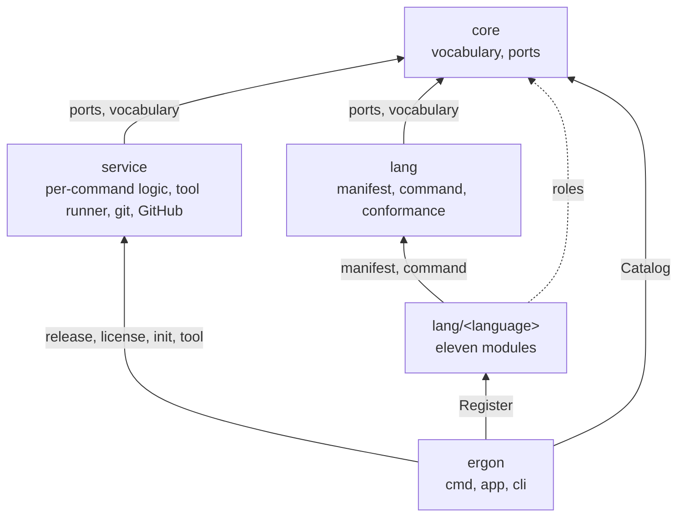

<!--
  ~ Copyright Dokimasia B.V. 2026
  ~ SPDX-License-Identifier: MIT
-->

# RFC-0001: Module boundaries

## Summary

Split ergon into Go modules in one repository.
`core` contains the vocabulary and the ports.
`service` contains the language-neutral side of each command, the tool runner, and the clients for git and GitHub.
`lang` contains the machinery that two or more languages use.
One module per language contains that language's side of every command, for eleven languages: C#, Java, Kotlin, PHP, JavaScript, TypeScript, Go, Python, Rust, Terraform and Bash.
The root module contains the binary and the composition root.
Dependencies run one way, so adding a language is a directory, a `go.work` line and one `Register` call.

## Motivation

Every ergon command has a part that differs per language and a part that does not.
`release` rewrites a different manifest for each package manager, and it plans the release the same way for all of them.
`init` renders a different toolchain configuration for each language, and composes the common files the same way for all of them.
A test runner, a coverage parser and a lint task list differ per language, while thresholds, stage filters and reports do not.
The earlier Go-only ergon had 15,040 lines of production code in 32 packages, and around 3,000 of those lines encoded Go semantics.

The per-language part brings its own dependencies and its own toolchain. Go's release needs `golang.org/x/mod` v0.40.0, and Rust's and Python's need a TOML parser that reports byte ranges. Each language's tests run its own toolchain:

| Language | Toolchain its tests run |
|---|---|
| C# | `dotnet` |
| Java, Kotlin | a JDK, Gradle |
| PHP | `php`, `composer` |
| JavaScript, TypeScript | `node`, with `npm`, `pnpm` or `bun` |
| Go | `go`, `git` |
| Python | `uv` |
| Rust | `cargo` |
| Terraform | `terraform` |
| Bash | `bash` |

Go declares dependencies per module.
A module per language keeps `golang.org/x/mod` out of the Rust module's `go.sum`.
It also lets `go test ./...` in one language's directory run with only that language's toolchain installed, so the CI matrix gets one row per module with one toolchain each.

A module that contains both a contract and the code consuming it lets the two grow into each other.
A consumer comes to take a concrete service instead of an interface, and a second copy of a rule appears in a second consumer.
The boundary between `core` and its consumers makes that visible to a linter.

## Detailed design

### The module graph

| Directory | Module path | Contains | Third-party |
|---|---|---|---|
| `ergon-core/` | `go.dokimi.dev/ergon/core` | Vocabulary, the catalog, the language and toolchain declarations, and the role interfaces | none |
| `ergon-service/` | `go.dokimi.dev/ergon/service` | The language-neutral side of each command, the tool runner, git, and the GitHub client | `github.com/spf13/viper` and `go.yaml.in/yaml/v3`, for the options of `.ergon.yaml`, and `github.com/apache/skywalking-eyes` and `github.com/bmatcuk/doublestar/v4`, for the license command |
| `ergon-lang/` | `go.dokimi.dev/ergon/lang` | Manifest editing, the subprocess runner and the conformance suite | a TOML parser |
| `ergon-lang-<language>/` | `go.dokimi.dev/ergon/lang/<language>` | One language each, and the toolchain it declares | The language's own, such as `golang.org/x/tools` for the analyzers of `ergon-lang-go` |
| `.` | `go.dokimi.dev/ergon` | `cmd/ergon`, the composition root, the command tree | `github.com/spf13/cobra` for the commands, `github.com/spf13/viper` for the configuration |

The language modules are `ergon-lang-csharp`, `ergon-lang-java`, `ergon-lang-kotlin`, `ergon-lang-php`, `ergon-lang-javascript`, `ergon-lang-typescript`, `ergon-lang-go`, `ergon-lang-python`, `ergon-lang-rust`, `ergon-lang-terraform` and `ergon-lang-bash`.



### The rules

1. `core` imports nothing else in this repository.
2. `service` imports `core` and nothing else in this repository.
3. `lang` imports `core` and nothing else in this repository.
4. `lang/<x>` imports `core` and `lang`, and never another `lang/<x>`, with two exceptions: `lang/typescript` imports the root package of `lang/javascript`, and `lang/kotlin` imports the root package of `lang/java`, for the name of the toolchain that builds them.
5. Only the root module imports a `lang/<x>`, apart from the two imports of rule 4.
6. Only `service/vcs` and `lang/go/release` run git. `lang/go/release` runs it through `golang.org/x/mod/zip.CreateFromVCS`, which runs `git archive`.
7. Only `service/forge` calls the GitHub API, and no other package in `service` imports it.

The rules apply to the production code. The tests of a language module also import `service/baseline`, whose test kit renders the language as `ergon init new` renders it.

A service is given what it calls through an interface the service declares. `service/release` declares the `Forge` interface, and `service/forge` satisfies it without importing `release`. The root module joins the two.

depguard enforces the rules from the root `.golangci.yml`, with a strict allow-list per module directory:

```yaml
linters:
  settings:
    depguard:
      rules:
        core:
          files: ["**/ergon-core/**"]
          list-mode: strict
          allow:
            - $gostd
            - go.dokimi.dev/assert
            - go.dokimi.dev/ergon/core
        kotlin-module:
          files: ["**/ergon-lang-kotlin/**", "!$test"]
          list-mode: strict
          allow:
            - $gostd
            - go.dokimi.dev/ergon/core
            - go.dokimi.dev/ergon/lang/java$
```

The `$` suffix asks depguard for an exact match. Without it, allowing `go.dokimi.dev/ergon/lang/java` would also allow `go.dokimi.dev/ergon/lang/javascript`, because depguard matches the other entries as prefixes of the import path.

Inside the workspace, `go.work` puts every module in the build list, so a module imports a sibling and builds without a `require` line for it. Only `GOWORK=off` reports the missing line, so the `go.mod` files cannot enforce these rules.

### Toolchains and languages

The catalog has two kinds of entry:

- A **toolchain** discovers packages and implements the roles that work on packages, such as the release roles.
- A **language** implements the roles that work on its source files and its configuration, such as `init`, and names the toolchain that builds it.

Java and Kotlin name `jvm`, the Gradle toolchain that the Java module declares. JavaScript and TypeScript name `js`, the npm, pnpm and bun toolchain that the JavaScript module declares. The other seven languages are their own toolchains. A module that declares a toolchain registers it before its language.

A Gradle project with Java and Kotlin sources is one package of one toolchain, so ergon discovers and releases it once. Its Java and Kotlin files still get each language's templates and gate tools. Every toolchain is in a language module, so the tests of each module need one toolchain, and `lang` contains no toolchain.

### Roles

Each command's ports are role interfaces in `core/language`, one file per command: `release.go` and `init.go`. A command selects the catalog entries that implement its role by type assertion, and reports `Unsupported` for an entry without it. `release` selects among the toolchains. `init` selects among the chosen languages and the toolchains they name, so the Java module renders the Gradle build of Java and Kotlin once. `license` has no role, because its only knowledge of languages is a table keyed by file type.

```go
// Toolchain states the facts about a build toolchain that the commands
// working on packages read. A toolchain package constructs exactly one.
type Toolchain struct {
	// Name identifies the toolchain in reports and in the publish plan.
	Name workspace.Toolchain

	// Markers are the file names whose presence activates the toolchain,
	// such as "go.mod" or "settings.gradle.kts".
	Markers []string

	// Discover lists the packages under root. It reads files, and it runs
	// a subprocess only when a manifest is a program, as a Gradle settings
	// script is.
	Discover func(ctx context.Context, root string) ([]workspace.Package, error)
}

// Declaration states the facts about a language that every command reads.
// A language module constructs exactly one.
type Declaration struct {
	// Name identifies the language in configuration, in init's answers and
	// in reports.
	Name workspace.Language

	// Toolchain names the toolchain that builds the language's packages.
	Toolchain workspace.Toolchain
}

// RegisterToolchain adds a toolchain and the package roles it provides to
// the catalog. It returns an error when the declaration is incomplete or
// the name is already registered.
func RegisterToolchain(c *Catalog, t Toolchain, roles ...any) error

// Register adds a language and the language roles it provides to the
// catalog. It returns an error when the declaration is incomplete, the name
// is already registered, or the toolchain it names is not registered.
func Register(c *Catalog, d Declaration, roles ...any) error
```

Each role is checked at compile time in the package that implements it:

```go
var (
	_ language.Versioner = (*Release)(nil)
	_ language.Packer    = (*Release)(nil)
)
```

Without that assertion, a signature that drifts from its role removes a capability without breaking the build.

The roles of `init` divide the files of a repository by concern, as RFC-0004 specifies:

- `Producer` returns the templates of a concern. Each language, each toolchain that two languages share, and each base producer of RFC-0004 implements it.
- `Calculator` returns the values that the templates of a producer read beyond the answers, the options and the contributions, such as the text of a license.
- `Configurable` returns a producer's options, which are a struct in the producer's own package. The struct composes the option types of `core/option`, adds the options that only its concern has, and validates them with its own rules.
- `Contributor` returns the jobs, the CodeQL analysis and the Dependabot updates of a producer as data. The GitHub producer renders them into the workflows.

A producer configures its own concern alone. A section of `.ergon.yaml` names the tools, the actions and the runtime versions of its own producer, and never those of another ecosystem. The section `github` configures the platform, and the section `go` configures the setup of Go in CI. A tool that runs in the gate of a language other than its own is a release binary, which the tool runner of `service/tool` installs without the toolchain that built it.

### Registration

The root module's `internal/app` calls the `Register` function of each language module, in a fixed order. Java precedes Kotlin, and JavaScript precedes TypeScript, because Kotlin and TypeScript name the toolchains that Java and JavaScript register. A module's `Register` calls `language.RegisterToolchain` for the toolchain it declares, and then `language.Register` for its language.

Nothing registers from `init`. An `init` with a blank import makes the language set depend on which packages happen to be imported. A test could then not build a catalog that contains only Go.

### A language module

```text
ergon-lang-go/
  go.mod        module go.dokimi.dev/ergon/lang/go
  doc.go        package golang
  language.go   Language, Toolchain and Register
  workspace/    go.work and go.mod discovery, for every command
  release/      the release roles
  baseline/     the init roles: the options of the section go and their rules,
                the templates, and the jobs in CI
  analysis/     the analyzers of lint-go: the prefix of error text, and the
                expiry of a skipped test
  cmd/          ergon-go-vet, which runs the analyzers
```

A language module contains everything about its language that differs from the other languages: the options of its section and their rules, its templates, its jobs, its CodeQL language and its Dependabot ecosystem, and the programs that its gate runs and that no other project provides. A language module that declares a toolchain has a `workspace/` package and one package per command it supports. `ergon-lang-typescript` and `ergon-lang-kotlin` have no `workspace/` or `release/` package, because the JavaScript and Java modules discover and release their packages. The package for `init` is `baseline`, because the compiler rejects an import of a package named `init` unless the import renames it. The root package of the Go module cannot be called `go`, because `go` is a keyword. It is `package golang`, imported as `go.dokimi.dev/ergon/lang/go`.

### The go.mod files

```text
ergon-core/go.mod         module go.dokimi.dev/ergon/core
ergon-service/go.mod      module go.dokimi.dev/ergon/service
                          require go.dokimi.dev/ergon/core
                          require github.com/spf13/viper, go.yaml.in/yaml/v3
                          require github.com/apache/skywalking-eyes
                          require github.com/bmatcuk/doublestar/v4
ergon-lang/go.mod         module go.dokimi.dev/ergon/lang
                          require go.dokimi.dev/ergon/core
ergon-lang-go/go.mod      module go.dokimi.dev/ergon/lang/go
                          require go.dokimi.dev/ergon/core
                          require go.dokimi.dev/ergon/lang
                          require golang.org/x/mod
                          require golang.org/x/tools, for go/analysis and go/packages
go.mod                    module go.dokimi.dev/ergon
                          require every module above, at tagged versions
                          require github.com/spf13/cobra, github.com/spf13/viper
```

Every language module requires `core`, and `service` for the test kit of its tests. It also requires `lang` once it uses that machinery. `ergon-lang-typescript` requires `ergon-lang-javascript`, and `ergon-lang-kotlin` requires `ergon-lang-java`. A `replace` directive for each required sibling lets each of these modules build and tidy outside the workspace. Inside it, `go.work` lists every directory, and builds and tests resolve across the modules without the network.

The root module has no `replace` directive. `go install <pkg>@<version>` refuses a module whose `go.mod` contains one, so a `replace` in the root module would stop `go install go.dokimi.dev/ergon/cmd/ergon@latest`. The other modules may contain a `replace` for a sibling, because the go command applies `replace` only in the main module. Until the siblings have tags and the vanity pages serve them, the root module builds only inside the workspace, because its `go.mod` cannot require them. Outside the workspace, `go mod tidy` fails with `404 Not Found` from `https://go.dokimi.dev/ergon/core/language?go-get=1`.

### Directory names and module paths

The directories follow techne's names, so `go.dokimi.dev/ergon/lang/go` is in `ergon-lang-go/`. The go command derives a module's tag prefix from its subdirectory in the repository. The tags are therefore `ergon-lang-go/vX.Y.Z`. The vanity page for each module has to publish that subdirectory in the fourth field of its `go-import` tag, which Go 1.25 added. Until it does, `go get` and `go install` look for `lang/go/` and fail. `go.work` makes local development independent of the vanity pages.

### Versioning ergon's own modules

Each module has its own version. The root module is an entry point, because users install it as a program.

- `go install` resolves versions from the root module's `require` lines only.
- Minimal version selection does not select a sibling release that no `go.mod` requires.
- A sibling release is therefore built into the binary only when the root module is released with a rewritten `require`.

The release planner releases an entry point whenever a module it depends on is released, directly or through another module. A change to `core` releases `core` and the root module. The root module's tag is the ergon version, and goreleaser builds from it.

### Adding a language

Three edits, in one commit:

1. Create `ergon-lang-<x>/` with a `go.mod` declaring `go.dokimi.dev/ergon/lang/<x>`, the name of the language, the name of its toolchain when it declares one, a `Register` function, and one package per supported command.
2. Add `./ergon-lang-<x>` to `go.work`.
3. Add its `Register` to the list in `internal/app`, after the module that declares its toolchain.

A language whose toolchain another module declares also gets a depguard rule that allows the root package of that module. Removing a language is the same edits in reverse.

### Adding a command

1. Add the role file in `core/language`, and any vocabulary package the roles need.
2. Add the command's language-neutral package in `service`.
3. Add one package in each language module that implements the role.
4. Add the command to `internal/cli`.

## Alternatives considered

### A. One module, with the layers as packages

Put every package in `go.dokimi.dev/ergon` and let depguard enforce the positions. depguard enforces the direction in both layouts, and one module keeps `go install` free of the `replace` rule and gives one version per release.

**Why not:** every command adds per-language code, and every language adds its dependencies and its toolchain. One module puts all of them in one `go.sum` and makes `go test ./...` need every toolchain at once. Deleting a language is also no longer a directory and a `go.work` line.

### B. One module per command

`ergon-release` contains the release planner and a package per language, and `ergon-test` does the same for tests.

**Why not:** Go's `go.mod` handling would appear in every command module that serves Go, and `golang.org/x/mod` would appear in each of their `go.sum` files. Removing a language would touch every command module.

### C. The npm and Gradle toolchains as packages in lang

`lang/js` and `lang/jvm`, beside the machinery that two languages use.

**Why not:** the release roles of both toolchains run their tools, so the tests of `lang` would need Node and a JDK with Gradle. The seven other toolchains are in the module of their language.

### D. One version for every module

A `fixed` group puts every module at the same version.

**Why not:** nothing imports ergon's modules, so a shared number tells nobody which modules are compatible. A change to `core` would tag all fifteen modules, and fourteen of those tags would point at unchanged content.

### E. Directories equal to module paths

`lang/go/` for `go.dokimi.dev/ergon/lang/go`. The go command's tag prefix would then equal the module path's suffix, and the vanity pages would work without the subdirectory field.

**Why not:** ergon follows techne's directory names, so the two repositories read the same way. The subdirectory field is the cost.

### F. A module for the GitHub client

`ergon-forge` beside the language modules, so that code writing to GitHub has a boundary of its own in review.

**Why not:** the client needs no third-party dependency. Its calls are the REST endpoints for refs, pull requests, releases and the pull requests of a commit, plus the GraphQL mutation `createCommitOnBranch`, and each is JSON over HTTPS through `net/http`. `service/vcs` already drives git from the same module, and the services are the client's only callers. A module would add a `go.mod`, a tag and a CI row and contain nothing. Rule 7 and depguard give the same review boundary inside `service`.

### G. One catalog entry per language

Each language registers discovery and the release roles itself, and Java and Kotlin each register Gradle.

**Why not:** a Gradle project with Java and Kotlin sources would be discovered twice and released twice, and so would a package with JavaScript and TypeScript sources.

### H. A module for each toolchain

`ergon-lang-js` and `ergon-lang-jvm`, which declare a toolchain without a language.

**Why not:** a module that declares a toolchain without a language is a third kind of module, with rules of its own. The Java and JavaScript modules declare the toolchains of Kotlin and TypeScript, as the seven other modules declare their own.

### I. Options and templates in core and service

One options struct in `core` for every language, a template engine in `core`, and the validation of every language's options in `service`.

**Why not:** a language could then not declare an option of its own, and an option of one language would change `core` and `service`. The language modules would contain templates and no code of their own.

## Drawbacks

- Fifteen `go.mod` files, and one more for each language added. Each needs its own tidy and pins its own dependency versions.
- A role change is a cross-module edit: `core`, `service`, and each language module that implements the role, in one commit.
- Adding a command touches `core`, `service`, each supporting language module and the root module: at least four modules.
- Each module has its own tags and its own changelog. A change to `core` produces two releases, `core` and the root module.
- `go get` and `go install` of every module except the root fail until the vanity pages publish the subdirectory field.
- The depguard allow-lists name every third-party dependency, so adding one is an edit to `.golangci.yml` as well as to `go.mod`.
- skywalking-eyes brings go-git, logrus and 4.57 MB of embedded assets into `ergon-service`.
- Coverage thresholds and the CI matrix grow a row per module.
- A command over packages and a command over languages iterate different catalog entries, so a reader has to know which kind each role is.
- Kotlin and TypeScript depend on the root packages of the Java and JavaScript modules, which are the two exceptions to rule 4.

## Unresolved and future work

- Publishing the subdirectory field on the vanity pages is not part of this proposal.

## References

| What | Where |
|---|---|
| techne's module boundaries, which this layout follows | `techne/docs/rfc/0001-module-boundaries.md` |
| Go-specific share of the earlier ergon, 3,000 of 15,040 lines | `go.thesmos.sh/ergon/docs/rfc/0001-multi-language-support.md` |
| `go install pkg@version` refuses `replace` | `cmd/go/internal/load/pkg.go:3462-3468`, go1.27.1 |
| Tag prefix from the module subdirectory | `cmd/go/internal/modfetch/coderepo.go:123-131` and `:557-559`, go1.27.1 |
| `replace` applies only in the main module | https://go.dev/ref/mod#go-mod-file-replace |
| Minimal version selection and `go install pkg@version` | https://go.dev/ref/mod#minimal-version-selection, https://go.dev/ref/mod#go-install |
| The `go-import` subdirectory field, from Go 1.25 | `cmd/go/internal/vcs/vcs.go:1183-1186` and `cmd/go/internal/modfetch/coderepo.go:113-131`, go1.27.1 |
| An import of a package named `init` needs a rename | `cmd/compile/internal/types2/resolver.go:276`, go1.27.1 |
| depguard | https://github.com/OpenPeeDeeP/depguard |
| cobra and viper | https://github.com/spf13/cobra, https://github.com/spf13/viper |
| The options of a tool in a subsystem of its language backend | Pants, `src/python/pants/backend/go/lint/golangci_lint/subsystem.py` and `src/python/pants/option/option_types.py` |
