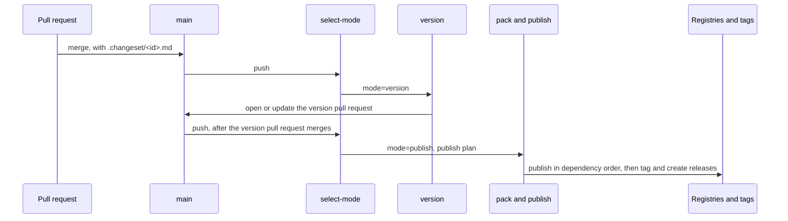

# RFC-0002: Release

## Summary

`ergon release` implements the changesets workflow for Go, TypeScript and JavaScript, Java and Kotlin, Rust and Python.
A pull request adds a changeset file that names packages and bump levels.
On `main`, ergon turns pending changesets into one version pull request.
That pull request contains the new versions, the rewritten requirements of dependents, the per-package `CHANGELOG.md` files and the refreshed lockfiles.
When the pull request merges, ergon packs, publishes, tags and creates GitHub Releases in dependency order.
ergon reads changesets' file format and `.changeset/config.json`, follows changesets v3's planning rules, and runs as four GitHub Actions jobs with the same names and outputs as `changesets/action` v2.

## Motivation

A package outside npm gets into a changesets release only as a private `package.json` written beside it.
changesets publishes to npm alone, and its maintainers closed a pull request that added other ecosystems on 2026-08-11.
They moved the question to a plugin system in a later major version.

The repositories ergon serves use all five languages:

| Repository | Language | Packages | How it releases now |
|---|---|---|---|
| techne | Go | 17 modules in one repository | the earlier ergon, per dependency layer; nothing published yet |
| assert-rust | Rust | 2 crates sharing `[workspace.package].version` | no release workflow |
| assert-python | Python | 1 distribution | a tag-triggered workflow that checks the tag against `pyproject.toml` |
| assert-typescript | TypeScript | 1 package | a tag-triggered workflow that checks the tag against `package.json` |
| stealthscale/stealth | TypeScript | a pnpm workspace with 80 pending changesets | `changesets/action` v2 |
| assert-java | Java, Kotlin | 2 Gradle projects at one version | a tag-triggered workflow that checks the tag against the Gradle version |

In the tag-triggered repositories, a person edits the manifest version and pushes a tag, and the workflow checks the tag against the manifest. None of these repositories has a `CHANGELOG.md`.

Go is the language no existing tool releases correctly:

- A Go module has no version field. Its version is a git tag.
- A dependent's `go.sum` needs the hash of the sibling version it requires, and that version does not exist before its tag.
- The earlier ergon releases a Go workspace one dependency layer at a time. For each layer it tags, pushes, rewrites the dependents' `require` lines, runs `go mod tidy` and commits. A workspace with N layers costs N commits, N pushes and the signatures for each.
- proxy.golang.org is inside that loop. When a version is requested before its tag exists, the proxy can take up to 30 minutes to serve it. One eidos release stopped on `unknown revision backend/golang@v1.7.0` for that reason.

| Tool | Bump source | Go | Dependents | Publishes |
|---|---|---|---|---|
| changesets 3.0.3 | `.changeset/*.md` | none | patch when out of range | npm |
| knope 0.23.0 | change files, commits | tags only; never edits `require` | none | no |
| sampo 0.21.0 | `.sampo/changesets/*.md` | none | transitive patch | Cargo, npm, Hex, PyPI, Packagist, Maven |
| release-please 17.11.2 | Conventional Commits | changelog only | patch through workspace plugins | no |
| Nx release 23.2.1 | version plans or commits | community plugin, tags only | patch | through project targets |

techne, eidos, treesitter and assert-go already build with the earlier ergon, and each has an `.ergon.yaml`. The release planner is language-neutral, and its language-specific parts fit the language modules that every ergon command uses, so `release` belongs in ergon.

## Detailed design

### The flow



Every pull request runs `ergon release status --since origin/main`, which exits 1 when the pull request changes a package without adding a changeset that names it.

### Changeset files

A changeset is a Markdown file in `.changeset/`. Every `*.md` file except `README.md` is read.

```md
---
"go.dokimi.dev/techne/core": minor
"dokimi-assert": patch
---

Add the Unit type to the vocabulary.
```

- The front matter has one `name: level` pair per line. The level is `major`, `minor`, `patch` or `none`. The name may be in double quotes, in single quotes, or unquoted. Any other line is an error that gives the file and the line. This is the subset of YAML that changesets writes, and `core/changeset` parses it with the standard library.
- The front matter may be empty. An empty changeset releases nothing and satisfies `status`.
- A name that two toolchains share is written `<toolchain>:<name>`, for example `python:dokimi-assert`.
- The body is the changelog entry for every package the file names.
- `ergon release add` writes quoted keys, as changesets does. The file name is a slug of the summary and four hex digits.

### Configuration

ergon reads `.changeset/config.json`.

| Key | ergon's behaviour |
|---|---|
| `baseBranch` | The branch `status` and `add` compare against |
| `changelog` | `"@changesets/cli/changelog"`, `["@changesets/changelog-github", {"repo": "<owner>/<name>"}]` or `false`. Any other value is an error, because ergon does not load JavaScript |
| `commit` | `false` only. Any other value is an error |
| `fixed` | Groups that share one version and are always released together |
| `linked` | Groups whose released members share the highest bump |
| `ignore` | Packages that are never released. A changeset that names an ignored and a released package together is an error |
| `updateInternalDependencies` | `"patch"` or `"minor"`: the smallest bump for which a dependent's requirement is rewritten while it still admits the new version |
| `privatePackages` | `version` and `tag` for packages marked private. Both default to `false` |
| `access` | npm access for packages without `publishConfig.access` |
| `changedFilePatterns` | The files that count as a change for `status` |
| `___experimentalUnsafeOptions_WILL_CHANGE_IN_PATCH` | `onlyUpdatePeerDependentsWhenOutOfRange` and `updateInternalDependents` (`"out-of-range"` or `"always"`) |
| `entrypoints` | ergon only. The packages users install as programs, for example `["go.dokimi.dev/ergon"]` |

### Commands

| Command | Reads | Writes |
|---|---|---|
| `ergon release init` | nothing | `.changeset/config.json`, `.changeset/README.md` |
| `ergon release add` | packages, the diff against `baseBranch` | one changeset. Flags: `--empty`, `-m`, `--bump <name>=<level>`, `--open` |
| `ergon release status` | changesets, the diff | the version plan on stdout. Flags: `--since`, `--output`, `--verbose` |
| `ergon release version` | changesets, config, manifests | versions, dependents' requirements, `CHANGELOG.md`, lockfiles. Deletes consumed changesets. Flag: `--dry-run` |
| `ergon release publish-plan` | manifests, changelogs, registries, tags | the publish plan. Flag: `--output` |
| `ergon release pack` | the publish plan | artifacts. Flags: `--from-publish-plan`, `--out-dir` |
| `ergon release publish` | the packed artifacts | registries, tags, GitHub Releases. Flags: `--from-pack-dir`, `--no-git-tag`, `--output` |
| `ergon release git-tag` | versions | tags only |
| `ergon release ci select-mode` | changesets, the publish plan | `mode` and the plan for the next job |
| `ergon release ci version` | the working tree after `version` | one commit on `ergon-release/<base>` and the version pull request |

`version` and `add` make no git writes. The CI commands are the only ones that call the GitHub API.

### Vocabulary

```go
// Package workspace (core/workspace) describes what discovery returns.

// Language is the registered name of a language, such as "go" or "rust".
// The catalog rejects a name that no language registered.
type Language string

// Toolchain is the registered name of a build toolchain, such as "go",
// "jvm" or "js". The catalog rejects a name that no toolchain registered.
type Toolchain string

// Package is one releasable unit: a Go module, a crate, an npm package, a
// Python distribution, or a Gradle or Maven project.
type Package struct {
	// Name is the name the registry knows: a module path, a crate name, an
	// npm name, a distribution name or group:artifact.
	Name string

	// Toolchain is the toolchain that discovered the package.
	Toolchain Toolchain

	// Dir is the package directory, relative to the repository root and
	// slash-separated. "." is the root.
	Dir string

	// Version is the version the manifest declares. For a toolchain without
	// a version field it is the newest CHANGELOG.md heading, or the zero
	// value when the package has never been released.
	Version version.Version

	// Source names the file and field the version is written to, when
	// other packages read it too, as with Cargo's [workspace.package].
	// Packages with the same non-empty Source form a fixed group.
	Source string

	// Private reports that the package is never published to a registry.
	Private bool

	// Deps are the requirements on other packages in this repository, in
	// manifest order. Requirements on external packages are not listed.
	Deps []Dependency
}

// Dependency is one requirement on another package in the repository.
type Dependency struct {
	// Name is the required package's Name.
	Name string

	// Kind is the section of the manifest the requirement is declared in.
	Kind Kind

	// Req is the requirement as written, in the toolchain's syntax.
	Req string
}

// Kind classifies a requirement by the manifest section it is declared in.
type Kind int

const (
	Runtime Kind = iota
	Optional
	Peer
	Dev
)
```

### The release roles

```go
// Package language (core/language), file release.go.

// Versioner is the release role every toolchain implements.
type Versioner interface {
	// Satisfies reports whether req admits v, in the toolchain's requirement
	// syntax. For Go, req is a minimum version and every later version
	// satisfies it.
	Satisfies(req string, v version.Version) (bool, error)

	// Rewrite returns req moved to admit v with the same operator, for
	// example "^1.2.0" to "^1.3.0" or "workspace:^" unchanged.
	Rewrite(req string, v version.Version) (string, error)

	// Apply writes edits into the manifests under root and refreshes the
	// lockfiles. It returns the repository-relative paths it changed. On
	// error it returns the paths written so far, and the caller restores
	// them.
	Apply(ctx context.Context, root string, edits []Edit) ([]string, error)

	// Tag returns the tag name for p at v.
	Tag(p workspace.Package, v version.Version) string
}

// Packer builds the publishable artifacts of pkgs into dir. The js, jvm and
// python toolchains implement it.
type Packer interface {
	Pack(ctx context.Context, root string, pkgs []workspace.Package, dir string) error
}

// Publisher uploads artifacts to a registry. A toolchain without it
// publishes by tag, as the go toolchain does.
type Publisher interface {
	// Published reports whether the registry already has p at its version.
	Published(ctx context.Context, p workspace.Package) (bool, error)

	// Publish uploads the artifacts of pkgs from dir, in the order given.
	Publish(ctx context.Context, dir string, pkgs []workspace.Package) error
}

// Edit is the change release makes to one package's manifest.
type Edit struct {
	// Package is the package as discovered.
	Package workspace.Package

	// Version is the new version, or Package.Version when only
	// requirements change.
	Version version.Version

	// Requirements maps a dependency's Name to its rewritten requirement.
	Requirements map[string]string
}
```

### The planner

The planner in `service/release` is a pure function of the packages, the changesets, the config and the existing tags. `status`, `version --dry-run` and `version` print the same plan. It follows changesets v3.

1. Parse every changeset. A key that matches no package is an error that gives the file and the line.
2. Give each named package the highest bump among the changesets that name it.
3. Repeat until a pass changes nothing:
   - **Dependents.** For each released package, bump each dependent that is not already released when `updateInternalDependents` is `"always"`, or when the dependent's requirement does not satisfy the new version. Runtime, optional and peer dependents get a patch. A dev dependent gets no bump.
   - **Fixed groups.** Every member of a configured `fixed` group, and every package sharing a `Source`, gets the group's highest bump and one version.
   - **Linked groups.** Each released member of a `linked` group gets the highest bump among the released members.
   - **Entry points.** An entry point gets a patch when any package it depends on, directly or through another package, is released.
4. Compute each new version. A `major` on `0.x.y` gives `1.0.0`.
5. Rewrite requirements. A dependent's requirement on a released package is rewritten when it no longer satisfies the new version, or when the bump is at least `updateInternalDependencies`. A peer requirement that still admits the new version keeps its range when `onlyUpdatePeerDependentsWhenOutOfRange` is set.
6. Refuse a Go `major` from `v1` upward. The module path needs a `/vN` suffix, and that is a source change for every importer.

A Go requirement is a minimum version, so it satisfies every later version. Under the default `updateInternalDependents`, a Go dependent is released only when a changeset names it or when it is an entry point.

### Changelogs

- `version` writes `<package dir>/CHANGELOG.md` in the format of `@changesets/cli/changelog` or `@changesets/changelog-github`. A repository that switches from changesets keeps one continuous file.
- The `github` format adds the pull request, the commit and the author. `service/forge` finds them from the commit that added each changeset file.
- For a toolchain without a version field, the newest `## X.Y.Z` heading in the package's `CHANGELOG.md` is its planned version. `publish-plan` tags the package when that heading is newer than its newest tag. This works with merge, squash and rebase merges.
- Each tag annotation and each GitHub Release body is the package's changelog section for that version.

### Go in one commit

For each Go module that another module in the repository requires without a directory `replace`, `lang/go/release` runs these steps in dependency order:

1. Rewrite each dependent's `require` lines with `modfile.File.AddRequire`.
2. Snapshot the working tree as an unreferenced commit with `git write-tree` and `git commit-tree`, using a temporary index. HEAD, the index and every ref keep their values.
3. Write the module's zip at its new version from that commit with `zip.CreateFromVCS`, into a `file://` proxy in a temporary directory.
4. Run `go mod tidy` in each dependent with `GOWORK=off`, `GOFLAGS=-mod=mod`, `GOPROXY=file://<tmp>,https://proxy.golang.org,direct` and `GONOSUMDB=<the repository's module paths>`.

A two-module spike confirmed it:

- Module `b` requires `a`. After a change to `a`, `b/go.mod` moved from `a v0.1.0` to `a v0.2.0`.
- `go mod tidy` wrote `a v0.2.0 h1:w5HkALvlnL7zCOcPLYMxLwgvohwDFY5FYfnGOyQNDk8=` into `b/go.sum`.
- After one commit and both tags, the hash of `a` at tag `a/v0.2.0` was the same value.
- `go mod verify` in `b` passed with an empty module cache and a proxy rebuilt from the tag.

Two facts make the result general:

- `dirhash.Hash1` hashes file names and file bytes only.
- `golang.org/x/mod/zip` and the go command read module files with the same command, `git -c core.autocrlf=input -c core.eol=lf archive --format=zip`.

A module required through a directory `replace` needs no zip, because `go mod tidy` reads it from disk. A cycle among modules without a `replace` has no fixed point for `go.sum`, so `version` refuses it and lists the modules in the cycle.

The tag prefix is the module's directory relative to the repository root. `status` checks that the vanity page publishes that directory by fetching `https://<module>?go-get=1`. `--offline` skips the check.

### Languages

| Language | Version written to | Internal requirement | Lockfile refresh | Pack | Publish |
|---|---|---|---|---|---|
| Go | nothing; `CHANGELOG.md` and the tag | `require` and `go.sum` | `go mod tidy` through the file proxy | none | tag `<dir>/vX.Y.Z`, or `vX.Y.Z` at the root |
| TypeScript, JavaScript | `package.json` `version` | ranges; `workspace:` prefixes are kept | `npm install --package-lock-only`, `pnpm install --lockfile-only`, `bun install --lockfile-only` | `npm pack`, `pnpm pack`, `bun pm pack` | `npm publish <tarball>` or `npm stage publish`, through OIDC |
| Java, Kotlin | `gradle.properties` `version=` | Gradle `project(...)` has no version | `--write-locks` when the build locks dependencies | a configured Gradle task | Central Portal upload with a user token and PGP signatures, then a wait for validation |
| Rust | `[package].version` or `[workspace.package].version` | `{ path, version }` | `cargo update --workspace` | none | `cargo publish --workspace`, through OIDC |
| Python | `[project].version`; nothing when it is `dynamic` | `name>=X.Y.Z` in `[project].dependencies` | `uv lock` | `uv build` | `uv publish` |

- ergon edits the version field and the requirements itself, with byte-range edits that keep formatting and comments. JSON and XML offsets come from `encoding/json.Decoder.InputOffset` and `encoding/xml.Decoder.InputOffset`, and TOML ranges from go-toml v2.4.3's `unstable.Parser`.
- ergon runs a language's tool only for lockfiles and artifacts. A dry run needs no toolchain.
- `uv build` publishes `[tool.uv.sources]` workspace entries as written, so ergon writes the requirement into `[project].dependencies`.
- `cargo publish` verifies a crate against the registry, so crates publish in dependency order. `cargo publish --workspace` orders them and is not atomic.
- An npm trusted-publisher configuration created after 2026-09-03 accepts only `npm stage publish` unless its owner allows direct publishing.
- bun 1.4.2's `bun install --lockfile-only` rewrites a workspace package's version in `bun.lock` without creating `node_modules`. `bun install --frozen-lockfile` passes with a `bun.lock` that records an older workspace version, so ergon runs the refresh itself and never uses bun's frozen check to detect a stale version. `bun pm pack` rewrites `workspace:^` to `^X.Y.Z`. All three were measured on a two-package workspace.

#### Credentials

The publish job reads no stored secret for npm, PyPI or crates.io, and reads four for Maven Central.

| Registry | Credential | Constraint |
|---|---|---|
| npm | OIDC trusted publishing, configured per package on npmjs.com | The trusted-publisher configuration names the repository, the workflow file and the environment |
| PyPI | OIDC trusted publishing, configured per project on pypi.org | The same |
| crates.io | OIDC trusted publishing, configured per crate on crates.io | Only versions of existing crates. A crate's first release needs a user owner's API token. The exchanged token expires after 30 minutes, and crates.io refuses the exchange when the workflow was triggered by `workflow_run` or `pull_request_target` |
| Maven Central | A Central Portal user token and a PGP signing subkey with its passphrase | The Central Portal has no OIDC. A token cannot be scoped to one namespace. Every file needs a `.asc` signature |

- `lang/rust` exchanges the job's OIDC token for a crates.io token itself, with `POST /api/v1/trusted_publishing/tokens`, as `rust-lang/crates-io-auth-action` does. It exchanges one token per publish chunk and revokes it afterwards, so a long workspace publish does not outlive a 30-minute token.
- The release workflow triggers on `push` to `main` and runs the repository's CI through `workflow_call`, as stealthscale/stealth does. A `workflow_run` trigger would stop every crates.io publish.
- The Maven Central secrets are environment secrets of a `release` environment with required reviewers, no self-review, no administrator bypass and deployments from `main` only. A repository secret is readable by anyone with write access. A job with `id-token: write` can also read environment secrets.
- Naming an environment changes the OIDC `sub` claim to `repo:<owner>/<repo>:environment:release`. Each npm, PyPI and crates.io trusted-publisher configuration names the same environment.
- The Maven Central token comes from a dedicated account that is an organization member with access to one namespace, and it has an expiry date. The token itself cannot be narrowed.
- `Published` for Maven Central calls `GET /api/v1/publisher/published?namespace=&name=&version=` with the token.

### The publish plan

`publish-plan` writes the same format as changesets v3, with a `toolchain` field on each entry. Each inner array is one dependency-ordered chunk.

```json
{
  "version": 1,
  "plan": [
    [
      { "kind": "tag-only", "toolchain": "go", "name": "go.dokimi.dev/techne/core", "version": "1.3.0" },
      { "kind": "publish", "toolchain": "rust", "name": "dokimi-assert", "version": "0.2.0" }
    ],
    [
      { "kind": "publish", "toolchain": "rust", "name": "dokimi-assert-tokio", "version": "0.2.0" }
    ]
  ]
}
```

A package enters the plan when its registry does not have its version, or, for a tag-only package, when its tag does not exist. `publish` checks `Published` again before each upload, so a re-run skips what an earlier run published.

### Tags

- Tag names follow changesets: `v{version}` in a repository with one package and `{name}@{version}` otherwise. Go tags follow the go command.
- On a workstation, `publish` and `git-tag` create annotated tags with `git tag -a`, which signs them when `tag.gpgSign` is set. One `git push --atomic` then pushes them.
- In CI, `publish` creates each tag with the GitHub REST endpoint for refs, as `changesets/action` does. Those tags are lightweight.
- A tag that exists at another commit stops the package's release with an error that names both commits. Registries and sum.golang.org keep the first content they saw for a version.

### CI

Four composite actions at `dokimasia/ergon/action/{select-mode,version,pack,publish}` have the paths, inputs and outputs of `changesets/action/*@v2`. Each one installs a pinned ergon binary, checks its SHA-256 against the release's `checksums.txt`, and runs one command.

| Job | Permissions | Runs | Output |
|---|---|---|---|
| select-mode | `contents: read` | `ergon release ci select-mode` | `mode`, `publish-plan-artifact-id` |
| version | `contents: write`, `pull-requests: write` | `ergon release version`, then `ergon release ci version` | the version pull request |
| pack | `contents: read` | the repository's build, then `ergon release pack` | `pack-dir-artifact-id` |
| publish | `contents: write`, `id-token: write`, environment `release` | `ergon release publish` | `released`, a JSON list of names and versions |

- `ci version` first points `ergon-release/<base>` at the base commit through the REST refs endpoint. It then commits with the GraphQL mutation `createCommitOnBranch`, passing `expectedHeadOid`, and opens the pull request or updates the open one. GitHub's schema states that commits made with this mutation are signed by GitHub and marked verified.
- GitHub ends a request after 10 seconds, and ergon's version commit includes lockfiles. `ci version` therefore splits a change whose base64 payload exceeds 6,666,668 bytes into several commits on the branch, each within that bound. The measurements on a scratch branch, with a user token, are in the following table.

| File size | base64 request payload | `createCommitOnBranch` | Verified | Git Database REST | Verified |
|---|---|---|---|---|---|
| 674,822 bytes | 899,764 bytes | 2.1 s | yes | 3.2 s | no, `unsigned` |
| 2,000,000 bytes | 2,666,668 bytes | 2.7 s | yes | 3.2 s | no, `unsigned` |
| 5,000,000 bytes | 6,666,668 bytes | 3.4 s | yes | 4.6 s | no, `unsigned` |
| 10,000,000 bytes | 13,333,336 bytes | 7.0 s | yes | 5.2 s | no, `unsigned` |

674,822 bytes is the size of `dokimasia/stealth/bun.lock`, the largest lockfile in these repositories.
- `pack` has no write permission and no OIDC token, so the repository's build scripts cannot publish or push.
- A push or a tag made with `GITHUB_TOKEN` does not start another workflow, and a pull request it opens runs workflows only after approval. Work that follows a release, such as goreleaser, runs as a later job in the release workflow and reads `released`.
- The version job needs the lockfile tool of every language in the repository. `status --verbose` lists them.

```yaml
on:
  push:
    branches: [main]

concurrency: release

jobs:
  select-mode:
    runs-on: ubuntu-latest
    permissions: { contents: read }
    outputs:
      mode: ${{ steps.mode.outputs.mode }}
      publish-plan-artifact-id: ${{ steps.mode.outputs.publish-plan-artifact-id }}
    steps:
      - uses: actions/checkout@v7
        with: { fetch-depth: 0, persist-credentials: false }
      - id: mode
        uses: dokimasia/ergon/action/select-mode@v1

  version:
    if: needs.select-mode.outputs.mode == 'version'
    needs: select-mode
    runs-on: ubuntu-latest
    permissions: { contents: write, pull-requests: write }
    steps:
      - uses: actions/checkout@v7
        with: { fetch-depth: 0, persist-credentials: false }
      - uses: actions/setup-go@v6
        with: { go-version-file: go.mod }
      - uses: dokimasia/ergon/action/version@v1
```

### Failure handling

| Failure | State afterwards | Recovery |
|---|---|---|
| A changeset key matches no package | Nothing written | The error gives the file and the line |
| A lockfile tool fails during `version` | ergon restores every file it wrote and every changeset it deleted | Fix the cause and re-run |
| `main` moves while the version pull request is open | The next push regenerates the pull request from the new `main` | None |
| The version pull request merges while a Go module it released had changed on `main` | A dependent's `go.sum` no longer matches the module content | `select-mode` recomputes the hashes, returns `version`, and the new pull request rewrites only `go.sum` |
| One package fails to publish | Earlier chunks are published and tagged | Re-run the workflow. `publish` skips what `Published` reports |
| A tag exists at another commit | That package is not published | The error names the tag and both commits |
| A Go cycle without `replace` | Nothing written | The error lists the modules in the cycle |
| A crate's first release in CI | That crate is not published. The chunks before it are | The error names the crate. A user owner publishes its first version with an API token, adds the trusted-publisher configuration, and re-runs the workflow |
| A reviewer rejects the `release` environment | Nothing published | The next push to `main` produces the same publish plan |

Invariants:

- `version` is idempotent. A second run over its own output writes the same bytes.
- `publish` tags a package only after its registry reports the version.
- Registries are not transactional. `publish` works chunk by chunk, so a re-run continues from the first package the registry does not have.

## Alternatives considered

### A. sampo for every language except Go, and ergon for Go

sampo has changeset files, registry-checked publishing in six ecosystems, lockfile refresh through each ecosystem's tool, a transitive cascade and a release pull request action.

**Why not:** a repository with Go and another language would run two tools, keep two change-file directories and run two CI flows. sampo also has no Gradle support.

### B. Contribute a Go adapter to sampo or knope

knope already tags Go modules with the right prefixes and refuses a major without `/vN`.

**Why not:** both tools parse changesets' quoted keys with the quotes attached, so an existing changesets file matches no package in either. knope also leaves dependents unreleased and leaves `require` lines as they are. Both are written in Rust, and ergon's other commands are Go, so the release logic would be in a second language.

### C. Nx release with version plans and a Go plugin

Nx has the right extension point, `VersionActions`, and file-based version plans.

**Why not:** every Go repository would need Node and Nx. The Go plugins with `VersionActions` tag only and never edit `go.mod`.

### D. Conventional Commits as the bump source

The earlier ergon and release-please infer the bump from commit subjects.

**Why not:** a changeset is reviewed with the pull request and can be edited until the release, and a commit subject is fixed at merge.

### E. The dependency-layer pipeline for Go

Tag each layer, push it, then pin and tidy the next layer against the published tags.

**Why not:** the layer pipeline needs a commit and a push per layer, which one version pull request cannot contain. It also depends on proxy.golang.org during the release.

### F. Writing versions with each ecosystem's own command

`npm version`, `uv version`, `mvn versions:set` and `cargo set-version` each write a version.

**Why not:** a dry run would need every toolchain installed. Each command has side effects of its own, and `uv version` re-locks by default. Cargo 1.98.1 has no `set-version` subcommand, so Rust would need a third-party plugin.

### G. Wrapping `changesets/action`

Run `changesets/action` with ergon as its `version-script` and `publish-script`.

**Why not:** the action's own logic assumes npm packages. ergon would still implement every command, and the Go and multi-language decisions would be split across two projects.

### H. The Git Database REST API for the version commit

Create a blob, a tree and a commit, then move the branch. Each file is a separate request, so no single request contains the whole change.

**Why not:** GitHub leaves those commits unsigned. On the scratch branch, all four REST commits reported `verified: false` with reason `unsigned`, and all four `createCommitOnBranch` commits reported `verified: true`. Splitting a large change across several `createCommitOnBranch` commits keeps each commit signed.

### I. A versions state file

release-please records every package's last version in `.release-please-manifest.json`.

**Why not:** the manifests, the changelogs and the tags already record every version. A fourth copy can disagree with them.

## Drawbacks

- ergon reimplements changesets' planner and changelog formats. Parity with changesets 3.0.3 needs a differential test on real repositories, and every changesets release can open a new difference.
- Five manifest formats need byte-range edits that keep formatting. Each language needs fixtures for every edit it makes.
- go-toml's byte ranges are in its `unstable` package, which does not promise backward compatibility. ergon pins the version.
- The Go file proxy runs one `go mod tidy` for each Go module that requires a released sibling without a `replace`. Tidy needs the network for third-party modules.
- The version job needs Go, Node with npm, pnpm or bun, Cargo, uv and a JDK, for whichever languages the repository contains.
- A CI release is signed by GitHub and not by a hardware key, and its tags are lightweight.
- `.changeset/config.json` gains `entrypoints`, a key changesets does not define.
- A partial publish is possible, because registries are not transactional.
- Maven Central needs four long-lived secrets: the token username, the token password, the signing subkey and its passphrase. The token cannot be scoped to a namespace.
- Each new crate needs a first release by hand with an API token, before trusted publishing can release it.
- The release workflow cannot trigger on `workflow_run`, so it cannot wait for a separate CI workflow. It runs CI itself through `workflow_call`.
- The `release` environment's required reviewers add one approval to every publish.

## Unresolved and future work

- Pre-release mode, as in `changeset pre enter` and `pre exit`, is not proposed.
- Snapshot releases are not proposed.
- Maven, Yarn and Composer are not proposed. The roles admit them without a change to `core`.
- A minimum bump measured by apidiff, cargo-semver-checks or japicmp is not proposed. It would join the planner as a floor under the declared bump.
- Sigstore bundles for Maven Central are not proposed. The Central Portal validates `.sigstore.json` files beside the `.asc` files, and the `dev.sigstore.sign` Gradle plugin signs through the job's OIDC token. Sonatype has stated that Sigstore does not replace PGP.

## References

| What | Where |
|---|---|
| changesets v3 planner, dependents | https://github.com/changesets/changesets/blob/main/packages/assemble-release-plan/src/determine-dependents.ts |
| changesets v3 range rewrite | https://github.com/changesets/changesets/blob/main/packages/apply-release-plan/src/utils.ts |
| changesets v3 publish plan | https://github.com/changesets/changesets/blob/main/packages/cli/src/commands/publish-plan/getPublishPlan.ts |
| changesets config keys and defaults | https://github.com/changesets/changesets/blob/main/packages/types/src/index.ts |
| changesets/action v2 jobs | https://github.com/changesets/action/blob/main/README.md |
| Signed commits through `createCommitOnBranch` | GitHub GraphQL schema, mutation description, read through introspection on 2026-09-24; https://github.com/changesets/ghcommit/blob/main/README.md |
| GraphQL API limits, with no request size limit stated | https://docs.github.com/en/graphql/overview/rate-limits-and-query-limits-for-the-graphql-api |
| changesets and other ecosystems | https://github.com/changesets/changesets/issues/849, https://github.com/changesets/changesets/pull/2124 |
| knope has no dependent cascade | https://github.com/knope-dev/knope/issues/1822 |
| sampo adapters | https://github.com/bruits/sampo/blob/main/crates/sampo-core/src/adapters.rs |
| `GITHUB_TOKEN` does not trigger workflows | https://docs.github.com/en/actions/concepts/security/github_token |
| proxy.golang.org caching | https://proxy.golang.org/ |
| `uv build` and workspace sources | https://github.com/astral-sh/uv/issues/9811 |
| Cargo 1.90 multi-package publish | https://doc.rust-lang.org/cargo/CHANGELOG.html |
| npm trusted publishers | https://docs.npmjs.com/trusted-publishers |
| crates.io trusted publishing, RFC 3691 | https://crates.io/docs/trusted-publishing, https://rust-lang.github.io/rfcs/3691-trusted-publishing-cratesio.html |
| crates.io token exchange, 30-minute expiry, refused triggers | https://github.com/rust-lang/crates.io/blob/ed382369c65cb636470f09c031a0b68352092079/src/controllers/trustpub/tokens/exchange/mod.rs |
| crates.io refuses a new crate through trusted publishing | https://github.com/rust-lang/crates.io/blob/ed382369c65cb636470f09c031a0b68352092079/src/controllers/krate/publish.rs |
| The exchange action | https://github.com/rust-lang/crates-io-auth-action |
| Central Portal user tokens | https://central.sonatype.org/publish/generate-portal-token/ |
| Central Portal API, including `/api/v1/publisher/published` | https://central.sonatype.com/api-doc |
| Maven Central signing requirements | https://central.sonatype.org/publish/requirements/gpg/ |
| Sigstore validation on the Central Portal | https://central.sonatype.org/news/20250128_sigstore_signature_validation_via_portal/ |
| Environment secrets and required reviewers | https://docs.github.com/en/actions/reference/workflows-and-actions/deployments-and-environments#environment-secrets |
| `id-token: write` and the environment in the `sub` claim | https://docs.github.com/en/actions/reference/security/oidc |
| bun 1.4.2 `--lockfile-only`, `--frozen-lockfile` and `pm pack` | measured on a two-package workspace, 2026-09-24 |
| `dirhash.Hash1`, `zip.CreateFromVCS` | `golang.org/x/mod` v0.40.0, `sumdb/dirhash/hash.go`, `zip/zip.go:619` |
| go-toml byte ranges | `github.com/pelletier/go-toml/v2` v2.4.3, `unstable/ast.go:61-63`, `unstable/parser.go:117-120` |
