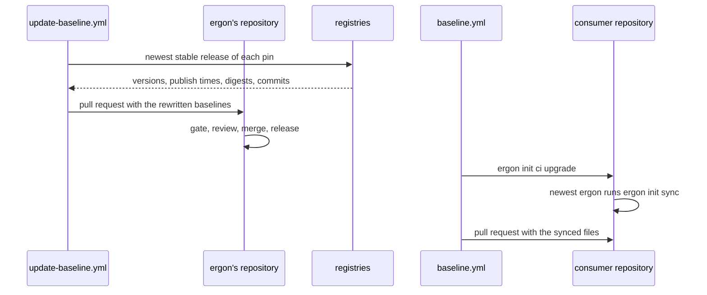

<!--
  ~ Copyright Dokimasia B.V. 2026
  ~ SPDX-License-Identifier: MIT
-->

# RFC-0005: Baseline updates

## Summary

ergon's baseline has 42 pins: 25 of tools, 15 of actions, one of GNU make and one of the hooks of pre-commit. A command in ergon's repository finds the newest release of each pin that is stable, at least seven days old and of the same major version. It rewrites the baseline of each producer with those releases. A weekly workflow opens the change as a pull request, which ergon's gate tests.

A repository receives the new baseline through `ergon init upgrade`. The command installs the newest release of ergon and runs its `ergon init sync`. The managed workflow `baseline.yml` runs `ergon init ci upgrade` weekly. That command opens the result as a pull request. No tool edits a managed file outside its rendering.

## Motivation

Each producer states its baseline in the literal that its `Options` method returns. A person updates a pin by hand:

- The version of a tool changes in its literal.
- A release binary also takes the SHA-256 of the asset of each of its three platforms. The five release binaries of the baseline pin 18 digests, because uv is a tool of two sections.
- An action takes a new release and the commit of its tag.
- The docblock of the `Options` method lists the versions again, and each update makes it wrong.

On 2026-10-08 the registries had newer releases of at least four pins: `actions/setup-node` v7.1.0 against the pinned v7.0.0, `shivammathur/setup-php` 2.40.0 against 2.37.2, phpstan 2.3.0 against 2.2.17, and ergon-go-vet v0.2.0 against v0.1.0. The gate passes with all four.

A repository receives a baseline through an upgrade of ergon and `ergon init sync`. Both steps are manual. The managed workflow `baseline.yml` checks the managed files against the newest release of ergon weekly. When they are outdated, it opens an issue with the commands to run.

Dependabot cannot do this work, because it does not read `.ergon.yaml`. It can only change a version where ergon has rendered it:

- the action pins of the workflows, through its ecosystem `github-actions`
- the `rev` of `.pre-commit-config.yaml`, through its ecosystem `pre-commit`

Both files are managed. `ergon init check` reports such a change as `edited`. `ergon init sync --force` then writes the version of `.ergon.yaml` back.

The update belongs in ergon, because a tool and its managed configuration change together. `.golangci.yml` states the configuration format `version: "2"` of golangci-lint. `biome.json` takes its `$schema` from the version of biome. A repository cannot change a managed file to fit a new tool. ergon's gate runs every tool of the baseline against those files.

## Detailed design

### Components

| Component | Where | Responsibility |
|---|---|---|
| Pins | `service/pin` | Finds the pins of the options of a producer, and resolves the newest release of each in its registry |
| Keys of the options | `service/baseline/options` | Lists the keys of the options of a producer with the field of each, which `pin.Find` reads |
| GitHub releases | `service/forge` | Lists the releases of a repository with the digests of their assets. The existing `Tag` returns the commit of a tag |
| Rewrite | `internal/rewrite` of the root module | Writes resolved releases into the literals of a producer's `Options` method |
| Baseline update | `internal/cmd/update-baseline` of the root module, not released | Resolves every pin of every producer, rewrites the sources, and opens the pull request |
| Upgrade | `internal/cli` | `ergon init upgrade` and `ergon init ci upgrade` |
| Release runner | `service/tool` | Installs and runs a release binary that no section names, such as a release of ergon |
| Lock guard | `service/baseline` | Refuses a lock that a newer release of ergon wrote |
| Overrides and conflicts | `service/baseline` | Lists the pins that `.ergon.yaml` sets to another version than the baseline, and returns the managed files that a sync leaves |
| Local check | `core/language`, `service/baseline`, `service/baseline/github` | Refuses a local file of `dependabot.yml` that lets Dependabot edit a managed file |
| Proposal | `service/release` | Opens or updates a pull request on a branch that the caller chooses, and reads the base branch of `.changeset/config.json` |



### Pins

A pin is a field of the options of a producer whose value refers to a release that a registry publishes. The type of the field states the kind of the pin:

| Kind | Type of the field | Registry | Publish time |
|---|---|---|---|
| Go module | `option.Module` | the module proxy of the GOPROXY protocol | `Time` of `@latest` or of `@v/<version>.info` |
| PyPI package | `option.PyPI` | the JSON API of PyPI | `upload_time_iso_8601` of the first file |
| npm package | `option.NPM` | the npm registry | `time` of the version |
| Crate | `option.Crate` | the sparse index of crates.io | `pubtime` of the line of the version |
| Maven artifact | `option.Maven` | `maven-metadata.xml` of Maven Central | `Last-Modified` of the POM |
| Composer package | `option.Composer` | the `p2` metadata of Packagist | `time` of the version |
| Release binary | a type that implements `option.Release` | the GitHub releases of its repository | `published_at` |
| Action | `workflow.Action` | the GitHub releases of the repository of `Uses` | `published_at` |
| Other version | `option.Version` with a tag `source` | `chocolatey:<package>` or `github:<owner>/<name>` | `Published` of Chocolatey, or `published_at` |

`github.make` has the tag `source:"chocolatey:make"`, and `common.pre-commit-hooks` has `source:"github:pre-commit/pre-commit-hooks"`.

A resolver takes the newest release of a pin under these rules:

- **Stable.** A version is stable when it is one to four numbers of at most 19 digits, separated by dots, with an optional leading `v`, such as `2.14.0` or `v7.0.1`. A resolver never takes a version with a suffix, such as a release candidate, a post-release or `-SNAPSHOT`. The prerelease flag of GitHub plays no part. conventionalcommit/commitlint marks every release as a prerelease, v0.12.0 included.
- **Order.** Versions compare by their numbers from left to right, not by date, and a missing number counts as 0. A release ranks above a pre-release of the same numbers, so a pin at `v2.0.0-rc.1` takes `v2.0.0`. actions/checkout published v6.1.0 and v5.1.0 after v7.0.1 on 2026-07-20.
- **Major.** The first number is the major version. An update keeps the major version of its pin. The resolver reports the newest stable release of a later major version beside it, and `-major` lets the update take that release.
- **Minimum age.** A release qualifies once its registry published it at least seven days before the run. `-min-age` sets another age. A module of ergon itself, under `go.dokimi.dev/ergon/`, qualifies at once.
- **Go modules.** The releases of a Go module are the stable versions of its `@v/list`, because `@latest` can lag the list. A Go module without tags, such as benchstat and dokimi-mutate-go, takes the pseudo-version of `@latest` once it is old enough. Pseudo-versions order by the time of their commit.
- **Module paths.** The value of a Go tool is a package path, such as `github.com/golangci/golangci-lint/v2/cmd/golangci-lint`. The module is the longest prefix of the package path whose `@latest` the proxy returns.
- **Digests.** A release binary takes the asset that `Asset` returns for each platform of the earlier pin, at the new version. GitHub states the SHA-256 of an asset in its field `digest`, also for the assets of releases of 2023 that were checked. For an asset without a digest, the resolver downloads the asset and hashes it. A release without the asset of a platform of the pin fails the pin.
- **Commits.** An action takes the commit of the tag of its release. `forge.Client.Tag` reads the commit through the tag object of an annotated tag, such as the tag v4.38.2 of github/codeql-action.
- **Shared tools.** uv is a tool of the sections `python` and `terraform`. Both pins have one name and one version, so both take the same release.

A release binary returns the repository of its releases through a new method of `option.Release`:

```go
// Package option (core/option).

// SourceTag is the key of the registry of a field of the type Version whose release a baseline
// update resolves, as <registry>:<name>: chocolatey:<package> or github:<owner>/<name>.
const SourceTag = "source"

// Release is a release binary of a section: a type that embeds [Binary] and states where its
// release publishes the asset of each platform.
type Release interface {
	// Pin returns the version and the digests of the binary.
	Pin() Binary

	// Asset returns the asset of p for the version of the pin. It returns an error that wraps
	// [ErrNoAsset] for a platform whose asset the release does not publish.
	Asset(p Platform) (Asset, error)

	// Repository returns the repository on GitHub whose releases publish the binary, as
	// owner/name, such as astral-sh/uv.
	Repository() string
}
```

`pin.Find` reads the keys of the options through `options.Fields`, which `service/baseline/options` exports. The decode of a section and the writer of `.ergon.yaml` read the same list:

```go
// Package options (service/baseline/options).

// Field is a key of the options of a producer. An exported field states the key in the options'
// struct, in a group of it, or in a struct that one of them embeds inline.
type Field struct {
	// Type is the type of the field. A field whose type is a struct is a group of options.
	Type reflect.Type

	// Key is the key of the field below the section, with the keys of its groups before it,
	// separated by dots, such as fuzz.time.
	Key string

	// Doc is the meaning of the field, which ergon init writes as the comment above its key.
	Doc string

	// Answer is the key of the answer of ergon init that the field states, or empty.
	Answer string

	// Index is the index sequence of the field from the options' struct, as
	// reflect.Value.FieldByIndex takes it.
	Index []int
}

// Fields returns every key of the options o at every depth, in the order of the fields. It returns
// an error that wraps ErrDefect for options that are not a pointer to a struct.
func Fields(o language.Options) ([]Field, error)
```

The package `pin` finds and resolves the pins:

```go
// Package pin (service/pin).

// The errors of the package.
var (
	// ErrRegistry is the error for a registry that fails, or that responds with a document that
	// the resolver cannot read.
	ErrRegistry = errors.New("pin: the registry failed")

	// ErrAsset is the error for a release that lacks the asset of a platform of its pin.
	ErrAsset = errors.New("pin: the release lacks an asset of a platform of the pin")

	// ErrSource is the error for a source tag outside the forms chocolatey:<package> and
	// github:<owner>/<name>.
	ErrSource = errors.New("pin: invalid source tag")
)

// Kind is the registry that publishes the releases of a pin.
type Kind uint8

// The kinds of pin.
const (
	KindModule     Kind = 1  // a Go module of the module proxy
	KindPyPI       Kind = 2  // a package of PyPI
	KindNPM        Kind = 3  // a package of the npm registry
	KindCrate      Kind = 4  // a crate of crates.io
	KindMaven      Kind = 5  // an artifact of Maven Central
	KindComposer   Kind = 6  // a package of Packagist
	KindBinary     Kind = 7  // a release binary of GitHub releases
	KindAction     Kind = 8  // an action of GitHub releases
	KindChocolatey Kind = 9  // a package of the Chocolatey community repository
	KindGitHub     Kind = 10 // a version of the GitHub releases of a repository
)

// Pin is a field of the options of a producer whose value refers to a release of a registry.
type Pin struct {
	// Value is the value of the field, such as an option.Module or a workflow.Action.
	Value any

	// Key is the key of the field in .ergon.yaml, such as go.tools.golangci-lint.
	Key string

	// Name is the released project in its registry: a package path of Go, a package, a crate,
	// group:artifact, vendor/package, a repository as owner/name, or a package of Chocolatey.
	Name string

	// Version is the version of the pin, such as v2.14.0 or 0.12.0.
	Version string

	// Field are the names of the Go fields from the options struct to the pin, such as Tools
	// and GolangCILint. An embedded struct has the name of its type.
	Field []string

	// Kind is the registry of the pin.
	Kind Kind
}

// Find returns the pins of o, the options of the section, in the order of options.Fields. It
// returns an error that wraps options.ErrDefect for options that options.Fields refuses, and
// [ErrSource] for an invalid source tag.
func Find(section string, o language.Options) ([]Pin, error)

// Release is a release of a pin in its registry.
type Release struct {
	// Published is the time at which the registry published the release, in UTC.
	Published time.Time

	// Digests are the SHA-256 digests of the assets of a release binary, by platform, in
	// lowercase hexadecimal, and nil for every other kind.
	Digests map[option.Platform]string

	// Version is the version of the release, in the form of the version of the pin.
	Version string

	// Commit is the commit of the tag of an action, and empty for every other kind.
	Commit string
}

// Resolution is what a [Resolver] finds for a pin.
type Resolution struct {
	// Next is the newest release that an update of the pin takes, and nil when the pin is at it
	// or no release qualifies.
	Next *Release

	// Major is the newest stable release of a later major version, which the update leaves to a
	// person, and nil when the resolver takes later major versions or there is none.
	Major *Release
}

// GitHub is the API of GitHub that a [Resolver] reads. *forge.Client implements it.
type GitHub interface {
	// Releases returns the published releases of repo, as owner/name.
	Releases(ctx context.Context, repo string) ([]forge.Release, error)

	// Tag returns the commit of the tag name of repo, through the tag object of an annotated tag,
	// and reports whether repo has the tag.
	Tag(ctx context.Context, repo, name string) (string, bool, error)
}

// Registries are the addresses of the registries of a [Resolver]. [PublicRegistries] returns the
// public ones.
type Registries struct {
	GoProxy, PyPI, NPM, Crates, Maven, Packagist, Chocolatey string
}

// Resolver resolves the newest releases of pins.
type Resolver struct {
	// Client reads the registries other than GitHub, and downloads an asset without a digest.
	Client *http.Client

	// GitHub reads the releases of GitHub.
	GitHub GitHub

	// Now returns the current time, against which MinAge counts.
	Now func() time.Time

	// Registries are the addresses of the registries.
	Registries Registries

	// Exempt are the prefixes of the names whose releases qualify at once, such as
	// go.dokimi.dev/ergon/.
	Exempt []string

	// MinAge is the time since the publication of a release before an update takes it.
	MinAge time.Duration

	// Major lets an update take a release of a later major version.
	Major bool
}

// Resolve returns the newest stable release of p, as [Resolution] states. It returns an error
// that wraps [ErrRegistry] for a registry that fails, for a project that the registry does not
// have and for a pin of no kind, and [ErrAsset] for a release binary whose new release lacks the
// asset of a platform of p.
func (r *Resolver) Resolve(ctx context.Context, p *Pin) (Resolution, error)
```

The client of GitHub gains the list of the releases. Its unexported type `release`, the body of the request that creates a release, becomes `newRelease`:

```go
// Package forge (service/forge).

// Release is a published release of a repository on GitHub.
type Release struct {
	// Published is the time at which the release was published.
	Published time.Time `json:"published_at"`

	// Tag is the tag of the release, such as v7.0.1.
	Tag string `json:"tag_name"`

	// Assets are the files of the release.
	Assets []Asset `json:"assets"`
}

// Asset is a file of a release.
type Asset struct {
	// Name is the name of the file, such as uv-x86_64-unknown-linux-gnu.tar.gz.
	Name string `json:"name"`

	// URL is the address from which the file downloads.
	URL string `json:"browser_download_url"`

	// Digest is the SHA-256 of the file in lowercase hexadecimal, and empty for a file without a
	// digest of that algorithm on GitHub.
	Digest string `json:"digest"`
}

// Releases returns the published releases of repo, as owner/name, newest first. It reads the
// list 100 releases at a time, and leaves out a draft. It returns an error that wraps
// [ErrGitHub] for a request that fails.
func (c *Client) Releases(ctx context.Context, repo string) ([]Release, error)
```

### The baseline update

`go run ./internal/cmd/update-baseline` runs in ergon's repository. The target `update-baseline` of its local Makefile runs it, and it needs `GITHUB_TOKEN`. The working tree must have no changes, because the changeset and the pull request cover every change of the tree.

1. It takes the producers of the common files, the GitHub files and the license files, and the toolchain and the producer of each language of `app.Register`.
2. It finds the pins of the baseline of each producer, in the options that `Options` returns.
3. It resolves each pin. The run reports a pin that does not resolve and continues with the other pins.
4. It lists the packages of ergon's modules with `go list go.dokimi.dev/ergon/...`, and reads the packages of the release and `.changeset/config.json`. It then rewrites the source of each producer whose pins have a newer release, through the package `rewrite`.
5. It runs the tests of each package of ergon's modules with golden files with `-update`, so the goldens render the new baselines.
6. It builds ergon from the sources and runs its `ergon init sync` in ergon's repository. ergon's own managed files then take the new baseline.
7. It writes a changeset. The changeset releases each module whose producer changed at `patch`, and lists each other module whose files changed at `none`. Its summary lists the updates.
8. With `-propose`, it commits the changes on the branch `ergon-update/<base>` through the API of GitHub, in signed commits. It then opens or updates the pull request into `<base>`. The body lists the updates, the newer major versions that it left out, and the pins that did not resolve. The log of the run states the error of each pin that did not resolve.

The command exits 1 when a pin does not resolve, after it has done every other step. Its flags are `-min-age`, `-major` and `-propose`.

The workflow `update-baseline.yml` of ergon's repository runs the command with `-propose` weekly and on `workflow_dispatch`. Its job has the permissions `contents: write` and `pull-requests: write`. The workflow is no managed file, like the workflow `binaries.yml`.

The package `rewrite` changes the sources:

```go
// Package rewrite (internal/rewrite of the root module).

// The errors of [Apply].
var (
	// ErrNoOptions is the error for a package without the Options method of the producer.
	ErrNoOptions = errors.New("rewrite: the package has no Options method of the producer")

	// ErrNotLiteral is the error for a pin whose value is no literal, such as a value that a
	// function computes or a field that the literal leaves out.
	ErrNotLiteral = errors.New("rewrite: the value of the pin is no literal")

	// ErrMismatch is the error for a literal whose value differs from the value of its pin, and
	// for a release without the digest of a platform of the pin.
	ErrMismatch = errors.New("rewrite: the literal differs from the pin")
)

// Update is a pin and the release that it moves to.
type Update struct {
	// Release is the release.
	Release pin.Release

	// Pin is the pin.
	Pin pin.Pin
}

// Apply writes updates into the Go files of the package in dir. In the Options method of the
// type producer, it follows the field names of each pin through the composite literals, and
// through a package-level variable that a field refers to. It then replaces the literals of the
// pin, and returns the files that it changed. It does not write a file when an update fails.
func Apply(dir, producer string, updates []Update) ([]string, error)
```

A pin is a string literal, a composite literal, or a package-level variable whose value is one. The variables `tools` of Java, Kotlin and PHP are such variables. The `Options` method of Go states the version of ergon-go-vet in its literal, as every other pin does. The docblocks of the `Options` methods list the pinned tools without their versions.

### Upgrade

| Command | Does | Flags |
|---|---|---|
| `ergon init upgrade` | Moves the repository to the baseline of the newest release of ergon, and lists each pin that `.ergon.yaml` sets to another version than that baseline | `--major`, `--force` |
| `ergon init ci upgrade` | Does the same in CI, and opens or updates the pull request of the change | `--major`, `--force` |

1. The newest release of ergon is the newest stable version of `go.dokimi.dev/ergon` that `pin.Resolver` finds in the module proxy. The command queries the first proxy of `GOPROXY` that is a URL, and proxy.golang.org when `GOPROXY` has none. Every release of ergon tags its root module, and the binaries of a release are built from that tag.
2. When that release is newer than the running ergon, the command downloads the archive `ergon_<version>_<os>_<arch>.tar.gz` of the release and checks it against the `checksums.txt` of the release. `tool.Runner.RunRelease` installs it into the cache of `ergon tool run` and runs the same command of the new release with the same flags. The command exits with the status of the release.
3. A release of a later major version needs `--major`. Without the flag, the command names that release on its standard error.
4. The variable `ERGON_UPGRADE` contains the release that a launch started, and that release does not start another one.
5. A build of ergon without a release cannot be ordered against a release, so it runs the upgrade itself.
6. The newest ergon refuses a lock that a build without a release wrote. It then runs `Repository.Sync` and lists the overrides.

`ergon init ci upgrade` continues after the sync:

1. It writes an empty changeset when the sync changed a file, so the job `changeset` passes.
2. It commits the changed files on the branch `ergon-baseline/<base>` and opens or updates the pull request into `<base>`. The title is `build: upgrade ergon to <version>`. The body lists the changed files, the overrides and the conflicts.
3. It exits 1 after it proposed the files of a sync with a conflict. A sync that only left conflicts proposes nothing, and the command exits 1.

The base branch is `baseBranch` of `.changeset/config.json`, which `release.ParseBaseBranch` reads without the packages of the repository. The managed workflow `baseline.yml` runs `ergon init ci upgrade` with the permissions `contents: write` and `pull-requests: write`. It installs the ergon of the lock, and the command starts the newest release itself.

The process of the command line gains two fields:

```go
// Package cli (internal/cli).

type Process struct {
	// The other fields are unchanged.

	// Transport sends the requests of ergon to GitHub, to the module proxy of Go and to the
	// registries of the tools, such as net/http.DefaultTransport.
	Transport http.RoundTripper

	// Platform is the system and the architecture that ergon runs on, such as linux/amd64, whose
	// release binaries ergon tool run and ergon init upgrade install.
	Platform option.Platform
}
```

### The lock guard, the overrides and the conflicts

Every command of `ergon init`, `ergon tool run` and `ergon license` reads the lock through `Repository`. The lock and the running ergon can both refer to a release. When the release of the lock is the newer one, the command fails before it reads anything else:

```go
// Package baseline (service/baseline).

// ErrNewerLock is the error of every command but New for a lock that a newer release of ergon
// wrote than the running one. Its text contains both releases.
var ErrNewerLock = errors.New("baseline: the lock is of a newer release of ergon")

// ConflictError is the error of a command for the managed files that it leaves, because they
// were edited by hand or exist with other content. It wraps ErrConflict.
type ConflictError struct {
	// Paths are the paths of the managed files that the command left.
	Paths []string
}

// Override is a pin that .ergon.yaml sets to another version than the baseline.
type Override struct {
	// Key is the key of the pin, such as go.tools.golangci-lint.
	Key string

	// Version is the version in .ergon.yaml.
	Version string

	// Baseline is the version of the baseline of the running ergon.
	Baseline string
}

// Overrides returns the pins of .ergon.yaml whose version differs from the baseline of the
// running ergon, in the order of the producers and of their keys.
func (r *Repository) Overrides() ([]Override, error)
```

### The local check

A producer may refuse the local file of a managed file that it renders:

```go
// Package language (core/language).

// ErrInvalidLocal is the error of a producer for a local file that the repository may not have.
var ErrInvalidLocal = errors.New("language: invalid local file")

// LocalChecker is a producer that checks the local files of its managed files.
type LocalChecker interface {
	// CheckLocal returns an error that wraps ErrInvalidLocal for content, the managed file at
	// path with its local file merged in, that the producer refuses.
	CheckLocal(path string, content []byte) error
}
```

`Repository` calls `CheckLocal` for each managed file with a local file, after the merge. The GitHub producer refuses a `.github/dependabot.yml` with an update of the ecosystem `github-actions` or `pre-commit`, because ergon renders the workflows and `.pre-commit-config.yaml`. The error contains the ecosystem and the managed files that Dependabot would edit.

### The proposal

`release.Proposal` gains the field `Branch`. `NewProposal` sets it to `ergon-release/<base>`, and `Propose` commits on it. The upgrade and the baseline update build their proposals from the same changed files as the version pull request, so the function that collects them is exported:

```go
// Package release (service/release).

// ChangedFiles returns the files of the working tree at root that differ from HEAD with their
// content, and the files that the working tree removed, each relative to root and
// slash-separated. It returns the error of git and the error of reading a file.
func ChangedFiles(ctx context.Context, root string) (map[string][]byte, []string, error)

// ParseBaseBranch returns the base branch of data, the content of .changeset/config.json, as
// ParseConfig reads it without the packages of the repository: its baseBranch, and main for a
// configuration without one. It returns an error that wraps ErrConfig for data that is no JSON
// object.
func ParseBaseBranch(data []byte) (string, error)
```

### Failure handling

| Failure | State afterwards | Recovery |
|---|---|---|
| The working tree of ergon's repository has changes | The update fails before it resolves a pin | Commit or remove the changes |
| A registry fails or returns an unreadable document | The other pins update, and the pull request lists the pin | The next run retries it |
| No release of a pin is old enough | The pin keeps its version | The next run takes the release once it is old enough |
| A new release lacks the asset of a platform of the pin | The pin keeps its version, and the pull request lists it | A person decides whether the baseline drops the platform |
| A pin is no literal | The update fails. The producers before the pin keep their rewritten sources | Make the value a literal, restore the working tree with git, and run the command again |
| The tests that regenerate the goldens fail | The command fails, and the sources keep their changes | Fix the producer or the test, and run the command again |
| The newest release of ergon has no archive yet, while its job Binaries runs | `upgrade` fails with the missing asset | Run it again after the job |
| `checksums.txt` has no line for the archive | `upgrade` fails | None. The release is broken |
| A managed file was edited by hand | `sync` writes every other file, and the pull request lists the conflict | Move the edit into the local file and run `ergon init sync --force` |
| The lock is of a newer release of ergon | Every command fails with both releases in its error | Install the newer release |
| A build without a release wrote the lock, and a release runs `upgrade` | `upgrade` fails | Run `ergon init sync` with that build |
| A local `dependabot.yml` updates `github-actions` or `pre-commit` | `check` and every command that writes fail | Remove the update from the local file |

Invariants:

- No command edits a managed file outside its rendering.
- An update moves a pin only to a stable release of its major version that is at least the minimum age old, unless `-major` or `-min-age` changes the rule.
- The pin of a release binary keeps a digest for every platform that it had.
- An upgrade never moves a repository to the baseline of an older release of ergon.

## Alternatives considered

### A. An update in each repository

`ergon init update` writes the newest release of each pin into `.ergon.yaml` of the repository, as `aqua update` writes the newest versions into `aqua.yaml`.

**Why not:** a value that differs from the record of the lock is a choice of the repository. `sync` never moves such a value again, so every pin becomes an override that each repository updates on its own. A new release that needs a change of its managed configuration fails the gate, and the repository cannot change the managed file. Every repository also repeats the download and the trust decision that one review in ergon covers.

### B. Dependabot for the rendered files

The local file of `dependabot.yml` adds the ecosystems `github-actions` and `pre-commit`, and Dependabot updates the pins where ergon renders them.

**Why not:** Dependabot edits managed files. `ergon init check` fails the job `baseline` on its pull request. After the merge, `sync --force` writes the version of `.ergon.yaml` back. Dependabot has no ecosystem for the tools of `.ergon.yaml` or for the digests of release binaries.

### C. Renovate in ergon's repository

The regex managers of Renovate find the versions in the literals of the producers and open the pull requests.

**Why not:** a regex manager replaces a version string. A new release binary also needs the digest of the asset of each platform, which needs the asset itself. The resolvers read the same registries from which `ergon tool run` installs, and the run does not need a service outside GitHub Actions.

### D. Baseline values in a data file

Each producer embeds a YAML file of its baseline values. The update rewrites that file as data, and `Options` decodes it.

**Why not:** the struct of a producer is the one source of each key, its baseline value and its meaning. The compiler checks the type of each value. A data file splits the value from its type and moves that check to a test. The rewrite of a literal keeps the value beside its field.

### E. The latest release of GitHub for the version of ergon

`gh release view` returns the latest release, as the input `latest` of `setup-ergon` does.

**Why not:** the repository of ergon publishes a release for the tag of each of its 14 modules. The latest release is the release of the root module only because a publish releases the root module last. The module proxy lists the versions of the root module alone, and each of them is a release of the binaries.

## Drawbacks

- `service/pin` reads seven registries and the releases of GitHub. It has 12 files: `doc.go` and 11 files with a test file each. A change of the API of a registry fails its pins until the resolver follows it.
- A run lists the releases of 21 repositories on GitHub: 15 of actions, 5 of release binaries and the hooks of pre-commit. Each listing reads one page per 100 releases. github/codeql-action had 560 releases on 2026-10-08, because it also publishes a release for each bundle of CodeQL. Each action that moves costs one or two more requests for its commit: the ref of its tag, and the tag object of an annotated tag.
- A Go module of a later major version has another path, such as `/v3`, so the resolver never finds it.
- The minimum age delays every release by a week, also the fix of a vulnerability. A person runs the command with `-min-age 0s` for such a fix.
- Each weekly pull request needs a person. The runs of a pull request that `GITHUB_TOKEN` opens wait for an approval, and a person reviews the change.
- A pin of a baseline must be a literal in `Options` or in a package-level variable, and the rewrite fails for any other value.
- `ergon init upgrade` downloads and runs a program, checked against the `checksums.txt` of the same release, as `setup-ergon` does in CI.
- A repository keeps each override across every upgrade. The upgrade lists it, and a person removes it.

## Unresolved and future work

- This proposal does not update the runner images of the section `github`, or the runtime versions of the pin files, such as the `go` line of `go.work`.
- The dependency manifests and the lockfiles remain the work of Dependabot.

## References

| What | Where |
|---|---|
| The GOPROXY protocol | https://go.dev/ref/mod |
| The JSON API of PyPI | https://docs.pypi.org/api/json/ |
| The npm registry API | https://github.com/npm/registry/blob/main/docs/REGISTRY-API.md |
| The sparse index of crates.io, and its field `pubtime` | https://crates.io/data-access, https://doc.rust-lang.org/cargo/reference/registry-index.html |
| The metadata of a Maven repository | https://maven.apache.org/repositories/metadata.html |
| The API of Packagist | https://packagist.org/apidoc |
| The API of the Chocolatey community repository | https://docs.chocolatey.org/en-us/community-repository/api/ |
| The releases, the git references and the tag objects of the REST API of GitHub | https://docs.github.com/en/rest/releases/releases, https://docs.github.com/en/rest/git/refs, https://docs.github.com/en/rest/git/tags |
| GitHub states the digests of release assets | https://github.blog/changelog/2025-06-03-releases-now-expose-digests-for-release-assets/ |
| Dependabot updates `.pre-commit-config.yaml` | https://github.blog/changelog/2026-03-10-dependabot-now-supports-pre-commit-hooks/ |
| pinact updates actions with a minimum release age | https://github.com/suzuki-shunsuke/pinact/blob/main/docs/update.md |
| `nx migrate` updates the versions that a plugin was tested with | https://nx.dev/docs/features/automate-updating-dependencies |
| Renovate updates the template of copier | https://docs.renovatebot.com/modules/manager/copier/ |
| aqua checks the checksums of assets | https://aquaproj.github.io/docs/reference/security/checksum |
