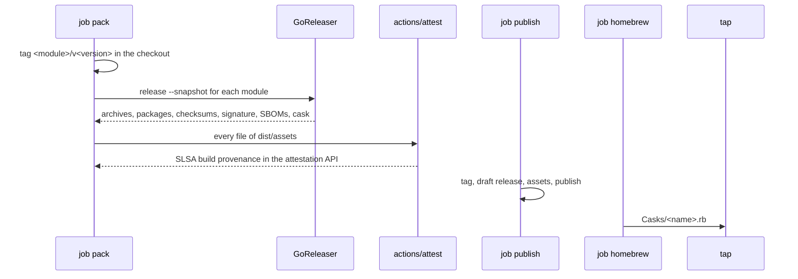

<!--
  ~ Copyright Dokimasia B.V. 2026
  ~ SPDX-License-Identifier: MIT
-->

# RFC-0007: Binary releases

## Summary

Each release of a Go module attaches the binaries of the commands of the module: an archive for each platform, `deb`, `rpm` and `apk` packages, and a Homebrew cask. Each release also has checksums, a cosign signature, SBOMs and SLSA build provenance. `.ergon.yaml` lists the commands under `go.binaries`, and ergon init renders the GoReleaser configuration of each module with a command.

A release has its assets from the moment it is published. The job `pack` of `release.yml` builds, signs and attests them, and `ergon release publish` attaches them to a draft release before it publishes the release. The module `go.dokimi.dev/ergon/buildinfo` reads the version of each command, which Go writes from the tag of the module.

## Motivation

ergon builds the binaries of its own releases with three files that its repository writes by hand: `.goreleaser.yaml`, the workflow `binaries.yml`, and a job `binaries` in its local `release.yml`. assert-go releases `assertlint`, a command of its module `lint`, whose tags are `lint/v<version>`.

Nine repositories of ThesmOS keep a hand-written GoReleaser configuration:

- They link the version into at least four different variables, from `internal/version.buildVersion` to `main.Version`.
- One publishes its cask with the description `TODO: short project description`.
- Each configures the changelog of GoReleaser, which repeats the notes that changesets writes.

The release flow of ergon constrains how a release builds its binaries:

- GoReleaser without Pro parses the current tag as a semantic version, and refuses a tag with a directory prefix, such as `lint/v0.1.0`. Its key `monorepo` is a feature of GoReleaser Pro.
- `ergon release publish` creates the tag and the GitHub Release of each package. `binaries.yml` attaches the archives to that release afterwards. A repository with immutable releases refuses that upload, because GitHub locks the assets of a published release. GitHub documents the order of a draft release, its assets, and then the publish.
- GitHub does not start a workflow for a tag that `GITHUB_TOKEN` creates, and does not create an event for the tags of a push of more than three tags. So `binaries.yml` runs as a called workflow after the publish, and through `workflow_dispatch` after a publish from a workstation.
- GoReleaser's version is a pin of the baseline. `goreleaser check` of 2.18.2 exits 2 on a deprecated key, such as `brews` or `archives.format`, so an update of the pin can break a configuration that a repository wrote.

Go writes the version of the main module into a binary from the tag of the commit, also from a prefixed tag. We measured it with Go 1.27.1 on 2026-10-09:

- A build of `lint/cmd/assertlint` at a commit with the tags `lint/v0.1.0` and `v0.3.0` recorded `go.dokimi.dev/assert/lint v0.1.0` and `vcs.modified=false`.
- A build of `cmd/ergon` through GoReleaser 2.18.2 without linker flags recorded `go.dokimi.dev/ergon v0.9.9` at the tag `v0.9.9`.
- Go appends `+dirty` to the version when the working tree has a file that git does not ignore (`cmd/go/internal/load/pkg.go`).

## Detailed design

### Components

| Component | Where | Responsibility |
|---|---|---|
| Command options | `lang/go/baseline` | The keys `binaries` and `homebrew` of the section `go`, and the release binaries GoReleaser, cosign and syft in `go.tools` |
| GoReleaser configuration | `lang/go/baseline` | Renders `<module>/.goreleaser.yaml` for each module that a command names, as a `language.Placer` |
| Assets of a contribution | `core/workflow` | `Contribution.Assets`: the producer builds release assets in the job `pack`, and names the tap of their casks |
| Release workflow | `service/baseline/github` | The permissions and the attestation of the job `pack`, and the job `homebrew` of `release.yml` |
| Go packer | `lang/go/release` | Builds the assets of each Go module of a publish plan that has a configuration |
| Pack | `service/release` | Calls the packer of a toolchain for the entries of both kinds of a publish plan |
| Release assets | `service/release`, `service/forge` | Creates a draft release, uploads its assets, publishes it, and completes a draft that an earlier run left |
| Casks | `service/release`, `internal/cli` | `ergon release ci homebrew` commits the casks of a publish to the tap |
| Version of a binary | `ergon-buildinfo`, the module `go.dokimi.dev/ergon/buildinfo` | Reads the version of the running binary |



### The options

The section `go` gains the keys `binaries` and `homebrew`:

```yaml
go:
  # The commands that each release of their module ships as archives, Linux packages and Homebrew
  # casks, which the job pack of release.yml builds, signs and attests.
  binaries:
    - name: ergon
      module: .
      main: ./cmd/ergon
      description: Sets up repositories and releases their packages.
      platforms: []
      completions: true
      packages: [deb, rpm, apk]
      homebrew: true
      license: ""
  # The Homebrew tap that receives the cask of each command whose homebrew is true, as owner/name.
  homebrew:
    tap: dokimasia/homebrew-tap
```

| Key | Value | When empty |
|---|---|---|
| `name` | The binary, and the name of its archives, packages and cask: lowercase letters, digits and `-`, unique in the list | Refused |
| `module` | The directory of the module in `go.work`, relative and slash-separated, `.` for the root module | Refused |
| `main` | The package of the command, relative to the module, such as `./cmd/ergon` | Refused |
| `description` | One line for the packages and the cask | Refused |
| `platforms` | The platforms of the builds, from linux, darwin and windows on amd64 and arm64 | Every platform |
| `completions` | When true, the release runs `<name> completion <shell>` of cobra for bash, zsh and fish | No completions |
| `packages` | The Linux packages, from `deb`, `rpm` and `apk`. Requires a Linux platform | No package |
| `homebrew` | When true, the tap receives a cask of the command. Requires `homebrew.tap` and a darwin or Linux platform | No cask |
| `license` | The SPDX identifier of the command, one of the identifiers of `--license` | The license of the repository |

`binaries` has no baseline value. A repository without commands renders no GoReleaser configuration, and its `release.yml` does not change. The producer of Go does not read the section `license`. A command inside a directory of `license.directories` states its license in the key `license`.

```go
// Package baseline (lang/go/baseline).

// Package is a Linux package format of a command.
type Package string

// The package formats of a command.
const (
	PackageDeb Package = "deb"
	PackageRPM Package = "rpm"
	PackageAPK Package = "apk"
)

// Command is a command whose binaries each release of its module attaches.
type Command struct {
	// Name is the name of the binary, and of its archives, packages and cask.
	Name string `yaml:"name"`

	// Module is the directory of the module in go.work, relative and slash-separated, or . for the
	// root module.
	Module string `yaml:"module"`

	// Main is the package of the command, relative to the module, such as ./cmd/ergon.
	Main string `yaml:"main"`

	// Description is one line that the packages and the cask state.
	Description string `yaml:"description"`

	// Platforms are the platforms of the builds, and every platform of a release binary when
	// empty.
	Platforms []option.Platform `yaml:"platforms"`

	// Packages are the Linux packages of the command.
	Packages []Package `yaml:"packages"`

	// License is the SPDX identifier of the command, or empty for the license of the repository.
	License spdx.ID `yaml:"license"`

	// Completions reports that the command is a cobra program whose command completion writes the
	// completions of a shell.
	Completions bool `yaml:"completions"`

	// Homebrew reports that the tap receives a cask of the command.
	Homebrew bool `yaml:"homebrew"`
}

// Validate returns an error that wraps option.ErrInvalid for the first value of c that a release
// cannot build: a Name outside lowercase letters, digits and '-', a Module that is not relative,
// clean and slash-separated, a Main that does not start with ./, a Description that is empty or
// spans lines, a platform or a package that is not valid or is named twice, a package without a
// Linux platform, a License that is not an identifier of --license, and Homebrew without a darwin
// or Linux platform.
func (c *Command) Validate() error

// Homebrew are the options of the casks of the commands.
type Homebrew struct {
	// Tap is the repository of the tap on GitHub, as owner/name, or empty for no tap.
	Tap string `yaml:"tap"`
}

// Options.Validate refuses two commands of one name, and a command with Homebrew while the tap is
// empty, beside the checks that it makes today.
type Options struct {
	// The other fields are unchanged.

	Binaries []Command `yaml:"binaries"`
	Homebrew Homebrew  `yaml:"homebrew"`
}

// Tools gains the release binaries of the binary releases.
type Tools struct {
	// The other fields are unchanged.

	GoReleaser GoReleaser `yaml:"goreleaser"`
	Cosign     Cosign     `yaml:"cosign"`
	Syft       Syft       `yaml:"syft"`
}

// GoReleaser is the release binary of goreleaser/goreleaser: a .tar.gz on Linux and macOS, and a
// .zip on Windows. Cosign is the release binary of sigstore/cosign, the program itself, without
// an asset for windows/arm64. Syft is the release binary of anchore/syft, a .tar.gz on Linux and
// macOS, and a .zip on Windows. Each implements option.Release.
type GoReleaser struct{ option.Binary `yaml:",inline"` }
type Cosign struct{ option.Binary `yaml:",inline"` }
type Syft struct{ option.Binary `yaml:",inline"` }
```

### The GoReleaser configuration

The producer of Go renders one GoReleaser configuration for each module that a command names: `.goreleaser.yaml` for the root module, and `<module>/.goreleaser.yaml` for any other. It writes them as a `language.Placer`. One run of GoReleaser releases one version, and each Go module has its own tag and version. `goreleaser release` has no filter of builds in 2.18.2.

The build of each command applies these optimizations:

- `CGO_ENABLED=0` builds a static binary, and lets the Linux runner build every platform.
- `-trimpath` removes the paths of the runner from the binary.
- `-ldflags=-s -w` leaves out the symbol table and the DWARF data.
- The build passes no `-X` flag, because Go writes the version from the tag of the module.
- `-pgo` defaults to `auto`, so Go applies a `default.pgo` beside the main package of a command (`go help build`). A repository commits a CPU profile there to optimize the command.
- The modification times of the binaries and of the files in each archive and package are the time of the commit, so the bytes of an asset do not depend on the time of the run.

Each configuration produces these assets:

| Asset | Content |
|---|---|
| Archive | `<name>_<version>_<os>_<arch>.tar.gz` for each command and platform, with the binary, `LICENSE`, `README.md` and the completions under `completions/`. Windows gets a `.tar.gz` as well, because `setup-ergon` unpacks a `.tar.gz` on every runner |
| Package | A `deb`, `rpm` and `apk` of nFPM for each command and Linux platform, with the binary in `/usr/bin`, the completions in `/usr/share/bash-completion/completions`, `/usr/share/zsh/vendor-completions` and `/usr/share/fish/vendor_completions.d`, and `LICENSE` as `/usr/share/doc/<name>/copyright` |
| Source archive | `<project>_<version>_source.tar.gz` of the commit |
| Checksums | `checksums.txt` with the SHA-256 of every other asset |
| Signature | `checksums.txt.sigstore.json`: cosign signs `checksums.txt` without a key, with the OIDC identity of the workflow |
| SBOMs | `<asset>.sbom.json`: syft writes an SPDX document for each archive and each package. `checksums.txt` lists them, so the signature covers them |
| Cask | `<name>.rb` with the URL and the SHA-256 of each archive under the tag of the module, the completions, and a hook that removes the quarantine attribute on macOS |

- The project of a configuration is the name of the repository for the root module, and `<repository>-<module>` for any other module, with each `/` of the module as `-`.
- The packages and the cask take their metadata from the answers of the lock: the owner as the vendor, the owner with the security contact as the maintainer, and the repository on GitHub as the homepage.
- The configuration disables the release and the changelog of GoReleaser, because ergon creates each release and changesets writes its notes.
- A hook writes the completions into `dist/completions/<name>/` with `go -C <module> run <main> completion <shell>`.
- The Go fragment of `.gitignore` ignores `/dist/`, so Go writes the version without `+dirty`.
- A repository adds to the configuration through `.ergon/local/<module>/.goreleaser.yaml`, as to every managed YAML file.

A probe on 2026-10-09 ran the following configuration of ergon's repository on two platforms, with commands that write a placeholder file in place of cosign and syft. It wrote the archives, the three packages, the source archive, `checksums.txt`, its signature, an SBOM of each archive and the cask, and the binary reported `v0.9.9`.

```yaml
# Managed by ergon init. Add repository settings to .ergon/local/.goreleaser.yaml and run ergon init sync.
#
# The commands of the module of this directory, which the job pack of release.yml builds, signs and
# packs for each release of the module. ergon release pack runs GoReleaser in snapshot mode with
# the version of the release in ERGON_VERSION, after it tags the commit with the tag of the module.

version: 2

project_name: ergon

dist: dist/goreleaser/ergon

snapshot:
  version_template: "{{ .Env.ERGON_VERSION }}"

before:
  hooks:
    - sh -c 'mkdir -p dist/completions/ergon && for s in bash zsh fish; do go -C . run ./cmd/ergon completion "$s" > "dist/completions/ergon/ergon.$s"; done'

builds:
  - id: ergon
    dir: .
    main: ./cmd/ergon
    binary: ergon
    env: [CGO_ENABLED=0]
    flags: [-trimpath]
    ldflags: [-s -w]
    mod_timestamp: "{{ .CommitTimestamp }}"
    targets:
      - linux_amd64_v1
      - linux_arm64_v8.0
      - darwin_amd64_v1
      - darwin_arm64_v8.0
      - windows_amd64_v1
      - windows_arm64_v8.0

archives:
  - id: ergon
    ids: [ergon]
    formats: [tar.gz]
    name_template: "ergon_{{ .Version }}_{{ .Os }}_{{ .Arch }}"
    builds_info: {owner: root, group: root, mtime: "{{ .CommitDate }}"}
    files:
      - src: LICENSE*
        info: {owner: root, group: root, mtime: "{{ .CommitDate }}"}
      - src: README.md
        info: {owner: root, group: root, mtime: "{{ .CommitDate }}"}
      - src: dist/completions/ergon/*
        dst: completions
        strip_parent: true
        info: {owner: root, group: root, mtime: "{{ .CommitDate }}"}

nfpms:
  - id: ergon
    ids: [ergon]
    package_name: ergon
    file_name_template: '{{ replace .ConventionalFileName "~" "-" }}'
    vendor: Dokimasia B.V.
    maintainer: Dokimasia B.V. <security@dokimi.dev>
    homepage: https://github.com/dokimasia/ergon
    description: Sets up repositories and releases their packages.
    license: MIT
    formats: [deb, rpm, apk]
    bindir: /usr/bin
    section: utils
    mtime: "{{ .CommitDate }}"
    contents:
      - src: dist/completions/ergon/ergon.bash
        dst: /usr/share/bash-completion/completions/ergon
        file_info: {mode: 0644, mtime: "{{ .CommitDate }}"}
      - src: dist/completions/ergon/ergon.zsh
        dst: /usr/share/zsh/vendor-completions/_ergon
        file_info: {mode: 0644, mtime: "{{ .CommitDate }}"}
      - src: dist/completions/ergon/ergon.fish
        dst: /usr/share/fish/vendor_completions.d/ergon.fish
        file_info: {mode: 0644, mtime: "{{ .CommitDate }}"}
      - src: LICENSE
        dst: /usr/share/doc/ergon/copyright
        file_info: {mode: 0644, mtime: "{{ .CommitDate }}"}
    deb:
      lintian_overrides:
        - statically-linked-binary
        - changelog-file-missing-in-native-package

source:
  enabled: true
  name_template: "ergon_{{ .Version }}_source"

checksum:
  name_template: checksums.txt
  algorithm: sha256

signs:
  - cmd: ergon
    signature: "${artifact}.sigstore.json"
    args: [tool, run, go.cosign, --, sign-blob, "--bundle=${signature}", "${artifact}", --yes]
    artifacts: checksum

sboms:
  - id: archives
    cmd: ergon
    args: [tool, run, go.syft, --, "$artifact", --output, "spdx-json=$document", --enrich, all]
    artifacts: archive
  - id: packages
    cmd: ergon
    args: [tool, run, go.syft, --, "$artifact", --output, "spdx-json=$document", --enrich, all]
    artifacts: package

homebrew_casks:
  - name: ergon
    ids: [ergon]
    binaries: [ergon]
    homepage: https://github.com/dokimasia/ergon
    description: Sets up repositories and releases their packages.
    license: MIT
    url:
      template: "https://github.com/dokimasia/ergon/releases/download/v{{ .Version }}/{{ .ArtifactName }}"
    completions:
      bash: completions/ergon.bash
      zsh: completions/ergon.zsh
      fish: completions/ergon.fish
    hooks:
      post:
        install: |
          if OS.mac?
            system_command "/usr/bin/xattr", args: ["-dr", "com.apple.quarantine", "#{staged_path}/ergon"]
          end
    repository:
      owner: dokimasia
      name: homebrew-tap
    skip_upload: true

changelog:
  disable: true

release:
  disable: true

metadata:
  mod_timestamp: "{{ .CommitTimestamp }}"
```

### The tools

`go.tools` gains three release binaries, each pinned by its version and a SHA-256 per platform: `goreleaser` 2.18.2, `cosign` 3.1.3 and `syft` 1.54.1. ergon runs GoReleaser through the runner of `ergon tool run`, and the configuration runs cosign and syft through `ergon tool run go.cosign` and `ergon tool run go.syft`. `ergon tool run` finds the repository from a parent directory, so a command that GoReleaser starts in its `dist` directory finds the options.

The baseline update of RFC-0005 updates these three pins and the new pin `github.ci.actions.attest` of `actions/attest` at v4.2.2, as it updates every other pin.

### The workflow contribution

```go
// Package workflow (core/workflow).

// Assets states that a producer builds the assets of releases in the job pack of release.yml.
type Assets struct {
	// Tap is the Homebrew tap on GitHub, as owner/name, to which the job homebrew of release.yml
	// commits the casks of the assets, or empty for assets without a cask.
	Tap string
}

// Contribution gains the assets of the producer.
type Contribution struct {
	// The other fields are unchanged.

	// Assets states that the producer builds release assets in the job pack, or is nil.
	Assets *Assets
}
```

`Options.Contribution` of Go returns `Assets` when `binaries` lists a command, with the tap when a command has `homebrew`. `render.Collect` refuses two contributions that name different taps. The GitHub producer renders `release.yml` with these changes when a contribution has assets:

| Job | Change |
|---|---|
| `pack` | Gains `id-token: write` and `attestations: write`. After `ergon release pack`, `actions/attest` attests every file under `dist/assets/` with SLSA build provenance, which GitHub stores in its attestation API |
| `publish` | No change in the workflow. `ergon release publish` attaches the assets |
| `homebrew` | Runs after `publish` when it published a package. It creates a token of the GitHub App of `ERGON_APP_CLIENT_ID` and `ERGON_APP_PRIVATE_KEY` for the tap with `contents: write`, and runs `ergon release ci homebrew --tap <owner/name> --from-pack-dir dist` with that token |

### Pack

`release.Pack` calls the packer of a toolchain for the entries of both kinds, `KindPublish` and `KindTagOnly`. The contract of `language.Packer` gains the release assets:

```go
// Package language (core/language).

// Packer is the release role of a toolchain whose packages a registry receives as artifacts, or
// whose releases have assets, such as the archives of the commands of a Go module.
type Packer interface {
	// Pack builds the artifacts of pkgs from root into dir. It writes the files that the registry
	// of a package receives, and the assets of the release of its tag into dir/assets/<tag>/. It
	// returns the error of the build.
	Pack(ctx context.Context, root string, pkgs []workspace.Package, dir string) error
}
```

`golang.Register` registers a packer for the toolchain of Go, built from a function that creates a local tag and from the runner of the tools of the section `go`:

```go
// Package release (lang/go/release).

// Packer builds the assets of the commands of Go modules with GoReleaser. A module has commands
// when its directory has .goreleaser.yaml.
type Packer struct {
	// Tag creates the lightweight tag name at HEAD of the repository at dir.
	Tag func(ctx context.Context, dir, name string) error

	// Run runs the tool of the section go with args in dir, with env added to the environment, as
	// ergon tool run does.
	Run func(ctx context.Context, dir, tool string, args, env []string) error
}

// Pack builds the assets of each package of pkgs whose directory has .goreleaser.yaml:
//
//   - It creates the tag of the package at its Version at HEAD, unless the tag is at HEAD.
//   - It runs goreleaser release --snapshot --clean with the configuration of the package and
//     ERGON_VERSION set to the Version.
//   - It copies the archives, the packages, the source archive, checksums.txt, its signature and
//     the SBOMs into dir/assets/<tag>/, and the cask into dir/casks/<tag>/.
//
// It returns an error that wraps release.ErrTag for a tag at another commit, and the error of
// GoReleaser.
func (p Packer) Pack(ctx context.Context, root string, pkgs []workspace.Package, dir string) error
```

The tag that `Pack` creates exists only in the checkout of the job `pack`. `ergon release publish` creates the same tag on GitHub, at the same commit. Snapshot mode does not need a tag in the form that GoReleaser parses, so no tag `v<version>` moves in the checkout.

### Publish

A release with assets follows the order that GitHub documents for immutable releases:

```go
// Package release (service/release).

// ErrAssets is the error of a releaser that cannot attach assets to a release, such as
// GitReleaser.
var ErrAssets = errors.New("release: the releaser cannot attach assets")

// Releaser records the releases of a publish.
type Releaser interface {
	// Tag is unchanged.
	Tag(ctx context.Context, name string) (string, bool, error)

	// Release creates the tag name at commit and its release, with notes and the files of assets.
	// It completes a release that an earlier publish left: it creates what the host lacks of the
	// tag, the release and the assets, and publishes a draft.
	Release(ctx context.Context, name, commit, notes string, prerelease bool, assets []string) error

	// Finish is unchanged.
	Finish(ctx context.Context) error
}
```

- `ForgeReleaser.Release` creates the tag, then the release as a draft, then uploads each asset that the draft lacks by name, and then publishes the release.
- `GitReleaser.Release` returns `ErrAssets` for a release with assets, so a publish from a workstation refuses a module whose pack directory has assets.
- `Publish` calls `Release` for an entry whose tag is missing, and for an entry whose tag is at HEAD and whose pack directory has assets, so a run after a failed upload completes the draft.

The client of GitHub gains the requests of a draft:

```go
// Package forge (service/forge).

// Release gains the fields of a draft.
type Release struct {
	// The other fields are unchanged.

	// ID is the identifier of the release in the API.
	ID int64 `json:"id"`

	// Draft reports a release that is not published.
	Draft bool `json:"draft"`
}

// CreateDraft creates the release of the tag of repo as a draft, titled after the tag, with the
// Markdown body, and returns it.
func (c *Client) CreateDraft(ctx context.Context, repo, tag, body string, prerelease bool) (Release, error)

// ReleaseOf returns the release of the tag of repo, a draft included, and reports whether repo
// has one.
func (c *Client) ReleaseOf(ctx context.Context, repo, tag string) (Release, bool, error)

// UploadAsset uploads the file at path as an asset of the release id of repo, named after the
// base name of the file.
func (c *Client) UploadAsset(ctx context.Context, repo string, id int64, path string) error

// Publish publishes the draft release id of repo.
func (c *Client) Publish(ctx context.Context, repo string, id int64) error

// PutFile writes content to path on the default branch of repo in one commit with message.
func (c *Client) PutFile(ctx context.Context, repo, path, message string, content []byte) error
```

### Casks

`ergon release ci homebrew --tap <owner/name> --from-pack-dir <dir>` commits each `<dir>/casks/<tag>/<name>.rb` to `Casks/<name>.rb` of the tap, in one commit per cask with the message `<name> <version>`. The publish plan of the pack directory lists the tags of the publish, so the command commits no cask of a release that the publish did not create. A commit of the GitHub App through the API is signed by GitHub.

### buildinfo

The module `go.dokimi.dev/ergon/buildinfo` in `ergon-buildinfo/` reads the version of the running binary. It requires `golang.org/x/mod`, which ergon already requires:

```go
// Package buildinfo (go.dokimi.dev/ergon/buildinfo).

// Development is the version of a build without a release.
const Development = "dev"

// Info is the build information of a binary.
type Info struct {
	// Time is the time of the commit, and the zero time for a build without a revision.
	Time time.Time

	// Version is the version of the release without its v, such as 0.6.0, or Development.
	Version string

	// Revision is the commit of the build, or empty.
	Revision string

	// Modified reports that the working tree of the build had changes.
	Modified bool
}

// Read returns the Info of the running binary, as From reads it.
func Read() Info

// From returns the Info of info. The version is the version of the main module without its v
// when a release tags the commit, as go build at a tag and go install of a version record it.
// Development replaces a nil info, (devel), a pseudo-version, and a version with +dirty.
func From(info *debug.BuildInfo) Info

// String returns the version with the short revision and the date of the commit, such as
// 0.6.0 (a5eb82a, 2026-10-08), which a cobra program sets as its Version.
func (i Info) String() string
```

With the module in place of `internal/buildinfo`, the refusal of ADR-0019 also refuses a build of a dirty tree at a release tag, for which `internal/buildinfo.Release` returns a version such as `0.5.0+dirty`.

### Migration

- ergon lists `ergon` under `binaries` with `completions`, the three packages and `homebrew`, and `dokimasia/homebrew-tap` as its tap. The managed `.goreleaser.yaml` replaces its own, and ergon deletes `binaries.yml` and the job `binaries` of `.ergon/local/.github/workflows/release.yml`. The archives keep their names, so `setup-ergon` installs every release.
- assert-go lists `assertlint` under `binaries` with the module `lint`, after a release of ergon contains this design.

### Failure handling

| Failure | State afterwards | Recovery |
|---|---|---|
| GoReleaser fails in `pack` | Nothing is published | Fix the cause and push. The next run of `release.yml` publishes the same versions |
| The tag of a module exists at another commit | `pack` fails before it builds | The same as the error `ErrTag` of `publish` |
| An upload fails in `publish` | The release remains a draft without some of its assets | Rerun the job. `publish` uploads the missing assets and publishes the draft |
| The App lacks access to the tap | The job `homebrew` fails, and the release is published | Install the App on the tap and rerun the job |
| A publish from a workstation meets assets in the pack directory | `GitReleaser` fails with `ErrAssets`, before the tag of that module | Publish through `release.yml` |
| Immutable releases are on | None, because the assets are uploaded before the publish | None |

Invariants:

- A published release of a module with commands has every asset that the job `pack` built for it.
- Each binary reports the version of the tag of its module.
- `checksums.txt` lists every asset but itself and its signature. The signature covers `checksums.txt`, and the attestation covers every asset.
- A tag that `pack` creates leaves the checkout only through the publish, which creates it at the same commit.

### Out of scope

- **CGO**: a build with CGO needs the container `goreleaser-cross` and a C compiler per platform. Only techne needs it, for tree-sitter. A second repository that needs CGO reverses this.
- **UPX**: a packed binary unpacks itself on each start, antivirus products flag packed binaries, and GoReleaser keeps UPX off in its own release.
- **Notarization on macOS**: it needs an Apple Developer ID, which costs a yearly fee. The hook of the cask removes the quarantine attribute instead.
- **Man pages**: cobra has no default command that writes them.
- **PowerShell completions**: no installer of this design puts them in place.
- **GPG signatures of the packages, and an apt or yum repository**: the cosign signature of `checksums.txt` covers the packages, and a package repository needs hosting outside GitHub Releases.
- **archlinux, ipk and msix packages**: Arch users install from the AUR, which takes a PKGBUILD, and msix needs a Windows signing certificate.
- **`GOAMD64=v3`**: it excludes processors without AVX2.
- **`gomod.proxy`**: it builds from the module proxy, which has no version of the module before the publish.
- **GoReleaser Pro**: `monorepo`, `metadata` and `verify` are features of Pro.

## Alternatives considered

### A. A configuration that each repository writes

Each repository keeps its own `.goreleaser.yaml`, as techne does.

**Why not:** GoReleaser's version is a pin of the baseline, and `goreleaser check` fails on a deprecated key, so each update of the pin would break the files of the repositories one by one. The nine repositories of ThesmOS also drifted apart.

### B. A configuration that ergon init writes once

ergon init seeds the file, and the repository maintains it afterwards, as `ergon release init` of the earlier ergon did.

**Why not:** a seeded file is a hand-written file after its first write.

### C. A job after the publish

A job of `release.yml` runs GoReleaser after the publish, as `binaries.yml` of ergon does.

**Why not:**

- A repository with immutable releases refuses the upload.
- A published release has no binaries until the job ends, and none when the job fails.
- A module in a subdirectory needs a local tag `v<version>`, which can move a tag of the root module in the checkout.

### D. The release of GoReleaser

GoReleaser creates the release and uploads the assets itself.

**Why not:** GoReleaser without Pro creates the release of the tag `v<version>`. For a module in a subdirectory, that is the tag of the root module.

### E. The version through linker flags

The configuration sets the version with `-X`.

**Why not:** each repository needs a package at a path that the configuration names, and Go writes the version from the tag without one.

### F. The actions of GoReleaser, cosign and syft

`goreleaser-action`, `cosign-installer` and `sbom-action` install the tools.

**Why not:** they add three pins of actions, and a workstation cannot run the same tools through them.

## Drawbacks

- The job `pack` gets `id-token: write`, and runs the code of the repository in the hook of the completions. The build runs in a job of the repository's own workflow, not in a reusable workflow that isolates the builder.
- A failure of GoReleaser blocks the publish of every package of the publish plan, also of the modules without commands.
- Each run of `pack` downloads GoReleaser, cosign and syft.
- A tap requires the GitHub App, also in a repository whose version pull requests do not use it.
- A release from a workstation has no assets.
- A cask of one repository overwrites a cask of the same name that another repository commits to the same tap.

## Unresolved and future work

- This proposal builds no container image, and publishes to no winget, Scoop, AUR or Nix repository.

## References

| What | Where |
|---|---|
| The archives, the packages, the checksums and the source archive of GoReleaser | https://goreleaser.com/customization/package/archives/, https://goreleaser.com/customization/package/nfpm/, https://goreleaser.com/customization/package/checksum/, https://goreleaser.com/customization/package/source/ |
| The casks of GoReleaser, and the deprecation of its formulas | https://goreleaser.com/customization/publish/homebrew_casks/, https://goreleaser.com/resources/deprecations/#brews |
| Signing with cosign v3 in GoReleaser | https://goreleaser.com/customization/sign/sign/, https://goreleaser.com/blog/cosign-v3/ |
| The SBOMs of GoReleaser | https://goreleaser.com/customization/sbom/ |
| The attestations of GoReleaser, and `actions/attest` | https://goreleaser.com/customization/publish/attestations/, https://github.com/actions/attest |
| The monorepo feature of GoReleaser Pro | https://goreleaser.com/customization/monorepo/ |
| Immutable releases on GitHub | https://docs.github.com/en/code-security/supply-chain-security/understanding-your-software-supply-chain/immutable-releases |
| The releases and the release assets of the REST API of GitHub | https://docs.github.com/en/rest/releases/releases, https://docs.github.com/en/rest/releases/assets |
| The contents of a repository in the REST API of GitHub | https://docs.github.com/en/rest/repos/contents |
| The flag `-pgo` of the go command | `go help build` |
