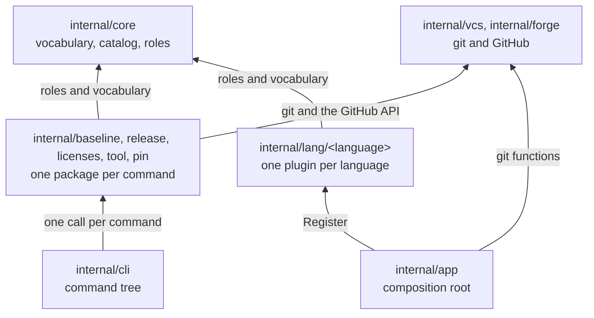

<!--
  ~ Copyright Dokimasia B.V. 2026
  ~ SPDX-License-Identifier: MIT
-->

# RFC-0008: Module and package structure

## Summary

We propose two Go modules in place of 14. `go.dokimi.dev/ergon` contains the CLI and `go.dokimi.dev/ergon/vet` contains ergon-go-vet. Every package of the CLI moves under `internal/`, where each command has a package of its own beside the kernel, the clients of git and GitHub, and the plugins of the languages. The options of a producer return its part of the workflows, its data and its files, so no producer asserts the type of its own options. A template function writes the Makefile targets that the gates of all languages share. One test over the catalog renders every producer.

## Motivation

ergon consists of 14 Go modules: the root module, `core`, `service` and 11 language modules. GitHub's code search finds no import of these modules outside ergon's repository. Other repositories install two programs from it: `cmd/ergon` of the root module and `cmd/ergon-go-vet` of the Go module.

We measured these costs on 2026-10-09:

- A Go module that requires a released module is released with it. Each language module requires `service` for its tests, so each release of `service` releases the 11 language modules. The fix of two files of `service/release` in commit 2fdb4d1 planned 13 releases: `service`, `ergon` and 11 language modules whose code did not change.
- The release of 2026-10-09 created 14 tags and 14 GitHub Releases.
- `ergon-lang-bash/go.mod` lists 13 indirect requirements through `service`, viper among them, and its `go.sum` has 46 lines. The production code of the module imports `core` alone, whose `go.sum` has 2 lines.
- The language modules contain 124 golden files with 5,806 lines. 2,162 of those lines are copies of the workflows that the GitHub producer renders: `ci.yml` in 11 modules, `security.yml` in 9 and `dependabot.yml` in 10.
- dupl finds clones of 103 to 246 lines between the test files of the language modules.
- All 16 producers implement both `Configurable` and `Contributor`. `Contribution` receives the options as the interface `language.Options`, so 14 producers assert their own options type and fall back to the baseline for any other type. The one caller passes each producer its own options, so the fallback runs in tests alone, and 29 test cases check these methods.
- The Makefile fragments of 10 languages declare the same targets for the generators and the gate, and 10 test files repeat one test of them.
- The Go plugin pins `go.dokimi.dev/ergon/lang/go/cmd/ergon-go-vet@v0.2.1`, a command of its own module, which is at v0.4.0. The weekly baseline update moves the pin to the newest release, and the move changes the module. The module is then released again, so the next update finds a newer release.
- `lint-go` runs golangci-lint once per module, 14 times in each gate.
- `internal/cli/upgrade.go` fetches `checksums.txt` over HTTP and parses GOPROXY itself. The tool runner already downloads the assets of releases, and the pin resolver already reads the module proxy.
- The package layout describes a module `ergon-lang` with `manifest`, `command` and `conformance`, a package `service/workspace`, and `workspace` and `release` packages for eight languages, and the repository has none of them.

We checked the purposes of a module per language against the code:

- A separate `go.sum` for each language isolates no dependency of the binary, which links every language. No other repository imports a language module.
- Tests that need one toolchain do not need a module. `go test ./internal/lang/rust/...` runs the tests of one language in any layout. The Go plugin is the one plugin with release roles, so its tests are the ones that run a toolchain: go and git.
- depguard checks the imports of a directory, so it checks the boundaries between the plugins in one module as in 14.

Tools with one plugin for each ecosystem keep their plugins as packages of one module:

- golangci-lint has 120 entries in `pkg/golinters`.
- GoReleaser has 67 entries in `internal/pipe`.
- Renovate has 118 package managers and 82 datasources in `lib/modules`, in one package.
- The go command has 45 packages under `cmd/go/internal`.

A change of the release planner alone removes one of these costs: the releases of the language modules for a change of `service`. Every other cost follows from the module boundaries and from where the packages are, so the proposal changes the layout of the repository.

## Detailed design

### Components

| Component | Where | Responsibility |
|---|---|---|
| The binary | `cmd/ergon` | Forwards the exit code of `cli.Run` |
| The composition root | `internal/app` | Registers the plugins in order, lists the base producers, and gives the Go plugin its git functions and its tool runner |
| The command tree | `internal/cli` | Parses the flags of a command, calls one command package, and writes the output |
| The version | `internal/buildinfo` | Reads the version that Go writes into the binary from the tag |
| The kernel | `internal/core` | The vocabulary, the catalog, and the roles that the plugins implement |
| `ergon init` | `internal/baseline` | The plan of a rendering, the lock, the options of `.ergon.yaml`, the local files, the template engine, the test kit, and the base producers `common` and `github` |
| `ergon release` | `internal/release` | The changesets, the planner, the versions and changelogs, the version pull request, the pack and the publish |
| `ergon license` | `internal/licenses` | The headers, the license texts, and the producer of `LICENSE` and `NOTICE` |
| `ergon tool run` | `internal/tool` | Installs and runs the tools of `.ergon.yaml` |
| The pin resolver | `internal/pin` | Resolves the newest release of a pin in eight registries |
| git | `internal/vcs` | Runs git, with a test kit for the repositories of tests |
| GitHub | `internal/forge` | Calls the API of GitHub |
| The plugins | `internal/lang/<language>` | One language each, its producer, and the toolchain that it declares |
| The baseline update | `internal/cmd/update-baseline`, `internal/rewrite` | Moves the pins of the baselines in ergon's repository |
| ergon-go-vet | `vet/`, the module `go.dokimi.dev/ergon/vet` | The analyzers errorprefix and skipexpiry, and the command that runs them |

### Modules

Other repositories install ergon-go-vet with `go install` and build it with their own Go toolchain, so the command has a module of its own: `go.dokimi.dev/ergon/vet` in `vet/`. The root module `go.dokimi.dev/ergon` contains every package of the CLI, and the two modules do not require each other.

```text
go 1.27.2

use (
	.
	./vet
)
```

```text
module go.dokimi.dev/ergon/vet

go 1.27.2

require (
	go.dokimi.dev/assert v0.0.0-20261007161809-4abc39fa6683
	golang.org/x/tools v0.51.0
)
```

- The tags of the root module are `v<version>`, and the tags of the vet module are `vet/v<version>`. `go.work` has no replace, because the two modules do not require each other.
- The Go plugin pins `go.dokimi.dev/ergon/vet/cmd/ergon-go-vet@<version>` as a literal, as it pins every other tool. A release of the vet module leaves the files of the root module unchanged. The next baseline update moves the pin and releases the root module once, and the update after it finds the pin at the newest release.
- The 13 retired module paths keep their tags on the module proxy and get no further release.

### Packages

```text
ergon/
├── cmd/ergon/
├── internal/
│   ├── app/
│   ├── cli/
│   ├── buildinfo/
│   ├── core/
│   │   ├── version/  changeset/  workspace/  spdx/
│   │   ├── option/  workflow/
│   │   └── language/
│   ├── baseline/
│   │   ├── lock/  options/  overlay/  render/
│   │   ├── common/  github/
│   │   └── baselinetest/
│   ├── release/
│   ├── licenses/
│   │   └── baseline/
│   ├── tool/
│   ├── pin/
│   ├── vcs/
│   │   └── vcstest/
│   ├── forge/
│   ├── lang/
│   │   ├── bash/  csharp/  java/  javascript/  kotlin/  php/  python/  rust/  terraform/  typescript/
│   │   │   └── baseline/
│   │   └── go/
│   │       └── workspace/  release/  baseline/
│   ├── rewrite/
│   └── cmd/update-baseline/
└── vet/
    ├── analysis/
    └── cmd/ergon-go-vet/
```

- Every package of the CLI is under `internal/`. The go command refuses an import of such a package from any package outside `go.dokimi.dev/ergon/...`, so a package can change its API without a release that announces the change.
- A package moves with the path of its directory. `go.dokimi.dev/ergon/service/release` becomes `go.dokimi.dev/ergon/internal/release`, and `go.dokimi.dev/ergon/lang/go/baseline` becomes `go.dokimi.dev/ergon/internal/lang/go/baseline`.
- The tree has no directory `service`. A command package has the name of its command, and the clients of git and GitHub are packages of their own.
- A plugin in `internal/lang/<language>` has a root package and one package for each command that it supports. The root package declares the names of the language and its toolchain, and `Register`.
- `internal/app` lists the base producers with `Producers`. `cmd/ergon` passes the list to `cli.Run`, and the baseline update reads it from `internal/app`.

```go
// Package app (internal/app).

// Producers returns the base producers, which render files in every repository before the
// languages: the common files, the GitHub files and the license files, in that order. Each call
// returns a new slice.
func Producers() []baseline.Producer

// Package cli (internal/cli).

// Run runs the command line of p and returns the exit status. register fills the catalog of the
// languages, base are the producers that render files in every repository before the languages,
// and v is the version of the running ergon.
func Run(ctx context.Context, p *Process, register func(*language.Catalog) error, base []baseline.Producer,
	v Version) int
```

### Dependency rules



depguard checks these rules by directory:

1. `internal/core` imports the standard library alone.
2. A plugin imports `internal/core` and its own tree. The Kotlin and TypeScript plugins also import the root package of the Java and JavaScript plugins, for the name of the toolchain that builds them.
3. A command package imports `internal/core`, `internal/vcs`, `internal/forge`, another command package and its own third-party libraries. It imports no plugin.
4. `internal/vcs` and `internal/forge` import the standard library alone.
5. `internal/app` is the only package that imports a plugin.
6. The vet module imports no package of the root module.

The tests of a plugin may also import `internal/baseline/render` and `internal/baseline/baselinetest`, to render a template of the plugin with options other than the baseline. The release tests of the Go plugin also import `internal/vcs` and its test kit, which create the repositories that `zip.CreateFromVCS` reads. Each plugin has a rule for its directory:

```yaml
linters:
  settings:
    depguard:
      rules:
        bash-plugin:
          files: ["**/internal/lang/bash/**", "!$test"]
          list-mode: strict
          allow:
            - $gostd
            - go.dokimi.dev/ergon/internal/core
            - go.dokimi.dev/ergon/internal/lang/bash$
            - go.dokimi.dev/ergon/internal/lang/bash/
```

### The contract of init

Every producer has options, and its options return its contribution, its data and its files:

```go
// Package language (internal/core/language).

// Producer renders the files of one concern of a repository: a language, a toolchain that two
// languages share, or a base producer. Its templates read the answers, its options, the values
// that its options compute, and the contributions of every producer.
type Producer interface {
	// Templates returns the templates of the producer. Their tree mirrors the repository under
	// managed/, seeded/ and shared/, and each name ends in .tmpl.
	Templates() fs.FS

	// Options returns a new value of the producer's options at the baseline.
	Options() Options
}

// Options are the options of a producer's section of .ergon.yaml: a pointer to a struct whose
// fields have yaml tags and doc tags, and types of the package option wherever one states the
// option.
type Options interface {
	// Validate returns an error for the first value that the producer cannot render. The command
	// checks the value of each field whose type has a Validate method before it calls Validate.
	Validate() error

	// Contribution returns the producer's part of the workflows: the jobs of ci.yml and
	// nightly.yml, the steps of a release, the assets of the releases, the CodeQL analyses and
	// the Dependabot updates.
	Contribution() workflow.Contribution
}

// Calculator is implemented by the options of a producer whose templates read values that the
// options compute.
type Calculator interface {
	// Data returns the values that the templates read as .Data, for the answers a and the
	// contributions c of every producer. Data reads no file and runs no command, and it modifies
	// neither a nor c. It returns an error for answers or contributions that the producer cannot
	// render.
	Data(a *Answers, c *workflow.Contribution) (any, error)
}

// Placer is implemented by the options of a producer that renders managed files at paths that the
// options state, beside the files of its templates.
type Placer interface {
	// Files returns these files for the answers a and the contributions c of every producer, under
	// the same rules as Data.
	Files(a *Answers, c *workflow.Contribution) ([]File, error)
}

// LocalChecker is a producer that checks the local files of the managed files that it renders.
type LocalChecker interface {
	// CheckLocal returns an error that wraps ErrInvalidLocal for content, the managed file at path
	// with its local file merged in, that the producer refuses.
	CheckLocal(path string, content []byte) error
}
```

The engine changes with the contract:

```go
// Package render (internal/baseline/render).

// Unit is a producer of a rendering: its name, the producer, and its resolved options.
type Unit struct {
	// Producer renders the templates of the unit.
	Producer language.Producer

	// Options are the resolved options of the producer.
	Options language.Options

	// Name is the name of the producer in the lock, such as common or go.
	Name string
}
```

- `render.Collect` calls `u.Options.Contribution()` for every unit.
- `render.Render` asserts `u.Options` to `language.Calculator` and to `language.Placer`.
- The type assertions to `Configurable` in `options.Producer`, in `baseline.Repository` and in the baseline update are deleted, because every `Producer` has `Options`.
- `Configurable` and `Contributor` are deleted, with the 16 `Contribution` methods of the producers, their fallbacks, the helpers `own` of the GitHub and license producers, and 29 test cases.
- The release roles do not change.

### The targets of the gate

The template engine gets one more function:

```go
// Package render (internal/baseline/render).

// targets returns the Makefile targets that the gate of every language shares, for the section of
// .ergon.yaml named section, such as bash, whose help names the language title, such as Bash:
//
//   - <SECTION>_GENERATE with the command and the arguments of g, generate-<section> and
//     verify-generate-<section>, when the command of g is not empty
//   - check-<section> with the target of each step of c, in order
//   - their entries in .PHONY and in the targets generate and check
//
// <SECTION> is section in uppercase. It returns an error that wraps ErrInvalidTemplate for a
// section that is not a word of lowercase letters.
func targets(section, title string, g option.Generate, c option.Check) (string, error)
```

The fragment of Bash calls `{}` after its own targets. With the command `./scripts/generate.sh --all` and the steps lint and generate, the call writes:

```make
.PHONY: generate-bash verify-generate-bash check-bash
generate: generate-bash
check: check-bash
BASH_GENERATE ?= ./scripts/generate.sh --all
generate-bash: ## Run the generators of Bash
	$(BASH_GENERATE)
verify-generate-bash: ## Fail when the generators of Bash change a file of the repository
	@$(call verify-generated,BASH_GENERATE,generate-bash)
check-bash: lint-bash verify-generate-bash ## Run the gate of Bash
```

- The fragments of the 10 languages other than Go call `targets`. The Go fragment keeps its own targets, because its generators run in each module of `go.work`.
- `make help` prints the same help lines. The targets of the generators move behind the other targets of a language, so the next `ergon init sync` rewrites the Makefile of each repository once.
- One test of `render` covers the function, in place of 10 tests in the plugins.

### Tests

| Where | What it tests |
|---|---|
| `internal/app` | Every producer of the catalog and every base producer: `Options` returns a new value on each call, the options at the baseline pass `Validate`, and the contribution passes `workflow.Contribution.Validate`. It renders `init new` with every language into one golden tree, and renders each language alone, which `baselinetest.Hygiene` checks without a golden file |
| `internal/lang/<language>/baseline` | The rules of the language: `Validate`, the URLs of `Asset`, and a template rendered with options other than the baseline |
| `internal/baseline/render` | The function `targets` |

The golden tree with every language contains each shared file once, so a change of the GitHub producer changes one `ci.yml`. A plugin that `internal/app` registers is in the test without a line of its own.

### The command layer

`internal/cli` keeps the flags of each command, one call per command, and the output, and the code of protocols moves into the command packages.

| Code | From | To |
|---|---|---|
| The digest of an asset in the `checksums.txt` of its release | `internal/cli/upgrade.go` | `internal/tool`, which requests it with the code that downloads the assets |
| The first module proxy of GOPROXY | `internal/cli/upgrade.go` | `internal/pin`, beside the public registries |
| The changed files of the working tree and the pull request that proposes them, for `ergon init ci upgrade` and the baseline update | `internal/cli/upgrade.go`, `internal/cmd/update-baseline/update.go` | `internal/release` |

```go
// Package tool (internal/tool).

// ReleaseDigest returns the SHA-256 of the asset of rel for the platform of r, from the
// checksums.txt in the directory of the URL of the asset. It returns an error that wraps
// ErrInstall for a request that fails, a status other than 200, and a checksums.txt without a
// line for the asset.
func (r *Runner) ReleaseDigest(ctx context.Context, rel option.Release) (string, error)

// Package pin (internal/pin).

// GoProxy returns the first module proxy of goproxy, a value of GOPROXY, that is a URL of http or
// https, without a slash at its end, and https://proxy.golang.org for a value without one.
func GoProxy(goproxy string) string

// Package release (internal/release).

// ProposeWorkingTree sets the files of p to the files of the working tree at root that differ
// from HEAD, as ChangedFiles returns them, and proposes p through f. It returns the number of the
// pull request, the error of ChangedFiles, and the error of Propose, which wraps ErrMoved when the
// base branch moved past p.Head.
func ProposeWorkingTree(ctx context.Context, f Proposer, root string, p *Proposal) (int, error)
```

The tool port of the Go plugin remains a run of `ergon tool run go.<tool>`. The runner needs the options of the section `go` of the repository, and `ergon tool run` reads them.

### Adding a language

1. Create `internal/lang/<language>/` with the name of the language, the name of its toolchain, `Register`, and the package `baseline`.
2. Add its `Register` to the list of `internal/app`, after the plugin that declares its toolchain.
3. Add a depguard rule for its directory.
4. Run the tests of `internal/app` with `-update`, which writes the golden files of the language.

### Migration

No changeset is pending across step 3, because each changeset lists the packages that it releases, and step 3 removes 13 of them. Each step leaves the gate green.

1. Create the module `vet` with `analysis` and `cmd/ergon-go-vet`, and release `vet/v0.1.0`. go.dokimi.dev serves a page for `go.dokimi.dev/ergon/vet`.
2. Pin `go.dokimi.dev/ergon/vet/cmd/ergon-go-vet@v0.1.0` in the Go plugin and in `.ergon.yaml`, and delete `analysis` and `cmd/ergon-go-vet` from the Go module.
3. Merge the other 13 modules into the root module with unchanged import paths: `ergon-core/` becomes `core/`, `ergon-service/` becomes `service/`, and `ergon-lang-<language>/` becomes `lang/<language>/`. Each loses its `go.mod`, `go.sum` and `CHANGELOG.md`. `go.work` lists the root module and `vet`, and the depguard rules match the new directories.
4. Move every package under `internal/` and remove the directory `service/`. The move rewrites 824 import lines in 266 files, and the compiler reports each import that it misses.
5. Change the contract of init, add `targets`, and move the rendering tests to `internal/app`.
6. Move the code of the command layer, and rewrite the package layout.

### Failure handling

| Failure | State afterwards | Recovery |
|---|---|---|
| A step misses an import | The build of the step fails, and the compiler names the import | Fix the import in the same step |
| A changeset names a retired module | The planner refuses the changeset with its file and line, and the version pull request is not opened | Name `go.dokimi.dev/ergon` in the changeset |
| A repository pins ergon-go-vet at `go.dokimi.dev/ergon/lang/go/cmd/ergon-go-vet` | `go install` builds a retired version of the command | `ergon init sync` with a release that contains step 2 renders the new path |
| `go install go.dokimi.dev/ergon/cmd/ergon@v0.6.0` | The go command builds that release with its 14 modules | None needed |
| The vet module is released | The root module pins the earlier release of ergon-go-vet | The next baseline update moves the pin and releases the root module once |

### Invariants

- `internal/app` is the only package that imports a plugin.
- A plugin imports `internal/core` and its own tree, and two plugins also import the root package of the plugin that declares their toolchain.
- `internal/core` imports the standard library alone.
- ergon has two modules, which do not require each other.
- A change of the CLI releases one module.
- The test of `internal/app` renders every producer that `internal/app` registers or lists.
- No producer asserts the type of its own options.
- The pin of ergon-go-vet names a release of the vet module.

## Alternatives considered

### A. A module per language, without the test imports

The language modules stay, and their tests stop importing `service`: the rendering tests move to the root module, and a test kit beside the roles checks the contract of each producer. The Go module keeps `service/vcs` and its test kit for its release tests.

**Why not:** the change of the tests leaves the other costs in place:

- 13 `go.mod` and `go.sum` files with replace blocks, and the versioned replaces of `go.work`.
- 14 tags for a change of `core`, and a release of the Go module for each release of `service`.
- 14 runs of golangci-lint in each gate.
- ergon-go-vet in the module whose plugin pins it, so the pin still changes its own module.

### B. One module, with ergon-go-vet

`go.dokimi.dev/ergon/cmd/ergon-go-vet` is a command of the root module, and the Go plugin pins it at the version of the running ergon.

**Why not:** `go install` of ergon-go-vet then loads the module graph of the CLI, whose `go.mod` lists 56 requirements, where the vet module requires `golang.org/x/tools` and its dependencies. Each release of ergon is also a release of ergon-go-vet, so every repository builds the command again after an upgrade of ergon, also when the analyzers did not change. A build of ergon from the workspace has no version to pin.

### C. Public packages

The packages keep their paths outside `internal/`, such as `go.dokimi.dev/ergon/core/version`.

**Why not:** no other repository imports them, and a public package promises an API that ergon does not keep. The package paths of the root module would also overlap the 13 retired module paths, such as `go.dokimi.dev/ergon/lang/go`, which the module proxy keeps.

### D. A test kit beside the roles

A package `core/language/languagetest` checks the contract of a producer, as `testing/fstest` checks an `fs.FS`, and each plugin calls it in its tests.

**Why not:** in one module, a test of `internal/app` reaches every producer that the binary registers, including a producer whose plugin does not call the kit.

### E. A partial template for the targets

The common producer renders `partials/targets.tmpl`, and each fragment calls it with `{}`.

**Why not:** the partial needs the name of the section and the title of the language beside the options. A template action passes one value to the template that it calls, and the data of a template contains only the answers, the options, the computed values and the contributions. The engine already passes the steps of a workflow job to its function `steps`, and a function `targets` receives all four arguments in the same way.

### F. The tool port in the same process

`internal/app` runs the tools of the Go plugin through `tool.Runner` instead of starting `ergon tool run`.

**Why not:** the runner needs the options of the section `go` of the repository, so `internal/app` would repeat the lookup of `.ergon.yaml` that `ergon tool run` performs. One process start per run of GoReleaser costs less than that copy.

### G. A planner that skips the requirements of tests

The release planner releases a dependent module only when a package of its production code imports the released module.

**Why not:** a released version resolves to the versions of its siblings that its tests ran against, and a planner that skips the requirements of tests breaks that rule. It also removes one cost of the list in the motivation and leaves the others.

## Drawbacks

- ergon's own release no longer has requirements between sibling modules. The tests of `release` and of the release roles of the Go plugin cover them, and the multi-module repositories that adopt ergon's release flow run them.
- One `go.sum` lists the dependencies of every language.
- The move rewrites 824 import lines in 266 files, so every open branch conflicts with it.
- `go test ./...` at the root runs the tests of every language.
- The 13 retired module paths stay on the module proxy, and go.dokimi.dev keeps a page for each of them.
- A change of any producer changes the golden tree of `internal/app`, which every producer shares.
- The first `ergon init sync` after the change rewrites the Makefile of each repository, because the targets of the generators move.

## Open questions

1. Is `go.dokimi.dev/ergon/vet` in `vet/` the module path you want for ergon-go-vet, or should the path name Go, such as `go.dokimi.dev/ergon/govet`?

## Unresolved and future work

None.

## References

| What | Where |
|---|---|
| The linters of golangci-lint as packages of one module | https://github.com/golangci/golangci-lint/tree/main/pkg/golinters |
| The pipes of GoReleaser | https://github.com/goreleaser/goreleaser/tree/main/internal/pipe |
| The managers and datasources of Renovate | https://github.com/renovatebot/renovate/tree/main/lib/modules |
| The packages of the go command | `src/cmd/go/internal` of Go 1.27.2 |
| Internal packages | `go help importpath`, https://go.dev/s/go14internal |
| The actions `define` and `template` of text/template | https://pkg.go.dev/text/template |
| The module graph that `go install` loads | https://go.dev/ref/mod#graph-pruning |
| depguard | https://github.com/OpenPeeDeeP/depguard |
| dupl, the clone detector | https://github.com/mibk/dupl |
